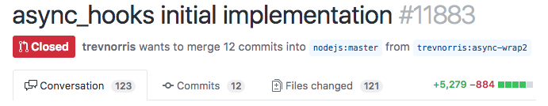
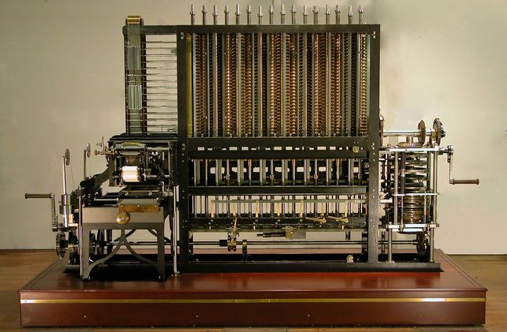
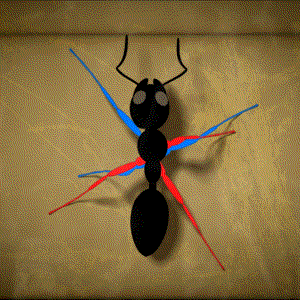
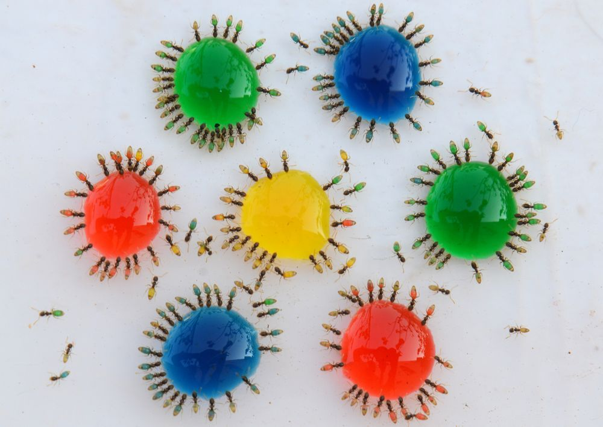
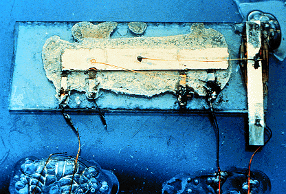
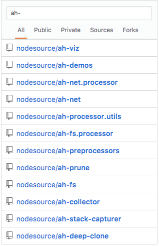
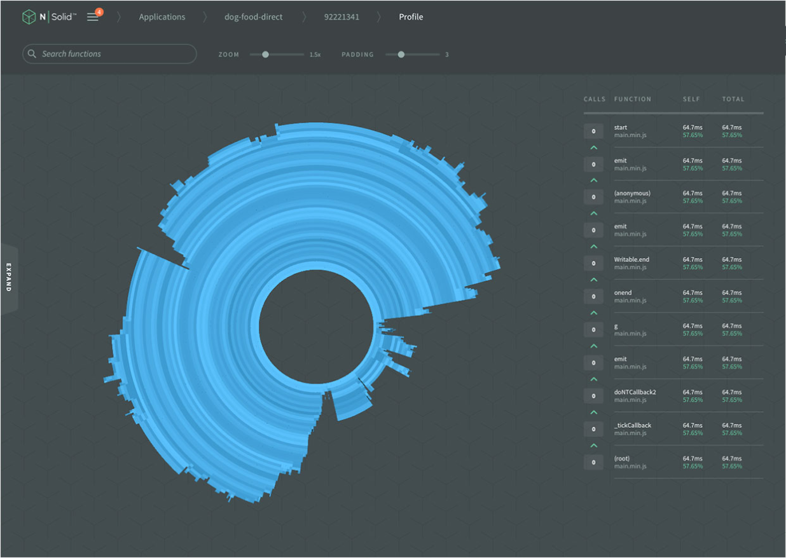

# Async Hooks


<p style="text-align: center;">
  <small><a href="http://thlorenz.com">Thorsten Lorenz</a></small>
</p>
<p style="text-align: center;">
  <a href="https://nodesource.com/">
    <svg width="60px" viewBox="0 0 97.34 97.34"><path d="M48.67,3.89A44.78,44.78,0,1,1,3.89,48.67,44.83,44.83,0,0,1,48.67,3.89m0-3.89A48.67,48.67,0,1,0,97.34,48.67,48.73,48.73,0,0,0,48.67,0Z"></path><path d="M49.81,71a1.14,1.14,0,1,1-2.28,0V26.34a1.14,1.14,0,1,1,2.28,0Z"></path><path d="M33.61,60.93A2,2,0,0,1,32,60.15l-12.22-16V59a2,2,0,0,1-3.94,0V38.39a2,2,0,0,1,3.53-1.2l12.22,16V38.39a2,2,0,0,1,3.94,0V59a2,2,0,0,1-2,2Z"></path><path d="M77.6,41.8l-.52-.31a15,15,0,0,0-1.39-.69,11.2,11.2,0,0,0-2.24-.71,10.08,10.08,0,0,0-3-.12,6.05,6.05,0,0,0-3,1,2.66,2.66,0,0,0-.85,1,2.47,2.47,0,0,0-.18.63V43s0-.2,0-.09v0a5.48,5.48,0,0,0,0,.55A2,2,0,0,0,67,44.53a4.81,4.81,0,0,0,1.52,1,13.64,13.64,0,0,0,2.19.7c.39.1.8.18,1.2.26s.85.16,1.37.29a14.23,14.23,0,0,1,5.62,2.49A6.69,6.69,0,0,1,81,52.19a6,6,0,0,1,.33,1.87v.66l0,.15,0,.16a5.29,5.29,0,0,1-.15.76,7.12,7.12,0,0,1-4.41,4.67,13.34,13.34,0,0,1-5,.91,11,11,0,0,1-1.14-.07c-.43,0-.78-.11-1.14-.17a14.27,14.27,0,0,1-1.92-.54,16.35,16.35,0,0,1-2.84-1.37,14.56,14.56,0,0,1-2.22-1.63l-.08-.08a1.77,1.77,0,0,1,2.34-2.65A12,12,0,0,0,66.58,56a13.43,13.43,0,0,0,2.25,1,10.4,10.4,0,0,0,1.4.36c.24,0,.51.08.71.09s.65,0,.81,0a9.48,9.48,0,0,0,3.46-.61,3.34,3.34,0,0,0,2.08-1.93,2.21,2.21,0,0,0-.91-2.57,10.59,10.59,0,0,0-4-1.71c-.34-.09-.88-.19-1.23-.26s-.93-.18-1.4-.3a17.46,17.46,0,0,1-2.83-.92,8.63,8.63,0,0,1-2.79-1.86,5.89,5.89,0,0,1-1.62-3.43c0-.34,0-.45-.05-.69V42.6c0-.15,0-.29,0-.44a6.41,6.41,0,0,1,.47-1.7A6.6,6.6,0,0,1,65,37.88,9.87,9.87,0,0,1,70,36a12.79,12.79,0,0,1,7.25,1.36A13.58,13.58,0,0,1,79,38.47l.54.4a1.77,1.77,0,0,1-2,3Z"></path><path d="M90.29,0a7.06,7.06,0,1,0,7.06,7.06A7.06,7.06,0,0,0,90.29,0Zm0,12.87A5.81,5.81,0,1,1,96.1,7.06,5.82,5.82,0,0,1,90.29,12.87Z"></path><path d="M88.58,10.24A.61.61,0,0,1,88,9.63V4.48a.61.61,0,0,1,.61-.61H91a1.89,1.89,0,1,1,0,3.78H89.19v2A.61.61,0,0,1,88.58,10.24Zm.61-3.81H91c.49,0,.81-.26.81-.67s-.32-.67-.81-.67H89.19Z"></path><path d="M92.41,10.24a.61.61,0,0,1-.5-.26L90.1,7.41a.61.61,0,0,1,1-.7l1.82,2.57a.61.61,0,0,1-.5,1Z"></path></svg>
  </a>
</p>
<p style="text-align: center;">
  <small>twitter <a href="http://twitter.com/thlorenz">@thlorenz</a>  |  github  <a href="http://github/thlorenz">@thlorenz</a>
</p>

# Why Async Hooks


- typical production Node.js application will have hundreds of concurrent actions taking place under the hood simultaneously
- serious Node.js users always wondered how to inspect and debug them

# Why Async Hooks


- early solutions tried to achieve this by patching core module functions and/or the EventEmitter
- none of them were satisfying and most of them hurt performance

# Why Async Hooks


- some decided ...
- **We can do better** ...

<audio src="http://trekcore.com/tos/audio/themes/OriginalSeriesMainTitle.mp3" autoplay />

<!-- notes
StarTrek original Words:

  Space: the final frontier.
  These are the voyages of the starship enterprise.
  It's five-year mission to explore strange new worlds ...
  To seek out new life and new civilizations ...
  To boldly go where no man has gone before.

Adapted to Async Hooks:

  Async Hooks: the missing piece of Node.js.
  These are the voyages of the Node.js core team
  It's four-year mission to explore strange new APIs ...
  To seek out new ways of capturing asynchronous operations.
  To boldly propose pull requests that no one had proposed before.
-->

# Why Async Hooks

### The Perfect Solution

> The `async_hooks` module provides an API to register callbacks tracking the lifetime of asynchronous resources created inside a Node.js application.

- generic solution to capture any asynchronous activity in a Node.js process
- minimal performance overhead
- powerful and flexible API

# Async Hooks History


- but we didn't get there right away

# Async Hooks History

- Aug 2013 Forrest Norvell proposed the continuation-local-storage (cls) core module
  - allowed propagating data through async requests
  - deemed too specific and Trevor Norris's quest for a more generic API began

# Async Hooks History

- Sep 2013 Trevor Norris' `AsyncListener` PR landed
  - zero overhead when not in use and highly flexible API
  - in conjunction the `AsyncWrap` class was created as a single point to track all asynchronous operations

# Async Hooks History

- Dec 2014 `AsyncListener` removed
  - due to unresolvable edge cases affecting all of core
  - hooks added to native `AsyncWrap` along with a JavaScript binding to facilitate experimentation

<audio src="img/omnious.mp3" autoplay />

# Async Hooks History

- Feb 2016 first `async_hooks` commit
- Sep 2016 initial `async_hooks` PR opened
  - superceded by a cleaned up PR that also added lots of tests
- May 2017 `async_hooks` PR merged, later released as part of Node.js version 8

# Async Hooks History



- the [async hooks pull request](https://github.com/nodejs/node/pull/11883) included lots of changes to core, mostly to C++
- **~5300** insertions!
- half of the changes were tests, but still ...

<audio src="img/success.mp3" autoplay />

# What Are Async Hooks

The `async_hooks` module provides an API to register callbacks tracking the lifetime of **asynchronous resources** created inside a Node.js application.

- _asynchronous resources_ are tracked in C++
- anything inheriting from the `AsyncWrap` class is an _asynchronous resource_

# Inheritance Chain


# Inheritance Chain


# Inheritance Chain


# Inheritance Chain


- `PipeWrap` used by `net.js` and therefore instantiated for each http/http2/net connection
- `PipeWrap` used by `child_process.js`, thus instantiated for each spawned process

# Tons of Providers

```
DNSCHANNEL
FSEVENTWRAP
FSREQWRAP
GETADDRINFOREQWRAP
GETNAMEINFOREQWRAP
HTTP2SESSION
HTTP2SESSIONSHUTDOWNWRAP
HTTPPARSER
JSSTREAM
PIPECONNECTWRAP
PIPEWRAP
PROCESSWRAP
PROMISE
QUERYWRAP
SHUTDOWNWRAP
SIGNALWRAP
STATWATCHER
TCPCONNECTWRAP
TCPWRAP
TIMERWRAP
TTYWRAP
UDPSENDWRAP
UDPWRAP
WRITEWRAP
ZLIB

// crypto
SSLCONNECTION
PBKDF2REQUEST
RANDOMBYTESREQUEST
TLSWRAP
```

# Async Hooks API

The `async_hooks` module provides an API to register callbacks tracking the lifetime of **asynchronous resources** created inside a Node.js application.

- pretty much anything happening in your Node.js process ends up creating an _asynchronous resource_ that can be tracked
  with `async_hooks`

# Async Hooks API

The **`async_hooks` module provides an API** to register callbacks (hooks) tracking the lifetime of asynchronous resources created inside a Node.js application.

# Async Hooks API

- focusing on hooks and APIs built on top of them for this talk, but a more advanced [Embedder API
  exists](https://nodejs.org/dist/latest-v8.x/docs/api/async_hooks.html#async_hooks_javascript_embedder_api)

# Async Hooks API

#### Life Time Events of Async Resources

- `init(asyncId, type, triggerAsyncId, resource)` called once
- `before(asyncId)` called zero or more times
- `after(asyncId)` called zero or more times
- `destroy(asyncId)` called once

# Async Hooks API

#### `init(asyncId, type, triggerAsyncId, resource)`

Called when a class is constructed that has the _possibility_ to emit an asynchronous event.

# Async Hooks API

#### `init(asyncId, type, triggerAsyncId, resource)`

- `asyncId` unique ID for asynchronous resource
- `type` type of the asynchronous resource == the provider
- `triggerAsyncId` the unique ID of the asynchronous resource in whose execution context this asynchronous resource was created
- `resource` reference to the resource associated with the asynchronous operation

# Async Hooks API

#### `init(asyncId, type, triggerAsyncId, resource)`

```js
function init(id, type, triggerAsyncId, resource) {
  print({ id, type, triggerAsyncId, resource })
}

const hook = asyncHooks.createHook({ init })
hook.enable()
setTimeout(() => {}, 10)
```

# Async Hooks API

#### `init(asyncId, type, triggerAsyncId, resource)`

```js
const http = require('http')
const server = http.createServer()

const hook = require('./_hook-print.init.js')
hook.enable()

server.listen()
```

- `TCPWRAP` _triggers_ `TickObject` which even refs the `server` via `args`

# Async Hooks API

#### `init(asyncId, type, triggerAsyncId, resource)`

- why can't we `console.log` inside `init`?

```js
const hook = require('./_hook-print.init.js')
hook.enable()

console.log('hello world')
```

# Async Hooks API

#### `init(asyncId, type, triggerAsyncId, resource)`

- why can't we `console.log` inside `init`?
- `console.log` itself causes resources to be created
- only `TickObject` is created for each `log` after the first, but ONE is all we need to loop endlessly

```js
const hook = require('./_hook-print.init.js')
console.log('hello')

hook.enable()

console.log('world')
```

# Async Hooks API

#### `before(asyncId)` and `after(asyncId)`

- `before` called just _before_ registered user callback is executed
- `after` called immediately _after_ registered user callback is executed

```js
function init(id, type, triggerAsyncId, resource) {
  print({ id, type, triggerAsyncId })
}

function before(id) {
  print({ stage: 'before', id })
}

function after(id) {
  print({ stage: 'after', id })
}

const hook = asyncHooks.createHook({ init, before, after })
hook.enable()
setTimeout(ontimeout, 10)

function ontimeout() {
  print('User callback fired')
}
```

# Async Hooks API

#### `before(asyncId)` and `after(asyncId)`

```js
{ id: 2, type: 'Timeout', triggerAsyncId: 1 }
{ id: 3, type: 'TIMERWRAP', triggerAsyncId: 1 }
{ stage: 'before', id: 3 }
{ stage: 'before', id: 2 }
'User callback fired'
{ stage: 'after', id: 2 }
{ stage: 'after', id: 3 }
```

# Async Hooks API

#### `before(asyncId)` / `after(asyncId)` / `destroy(asyncId)`

- `destroy(asyncId)` called after the resource corresponding to `asyncId` is destroyed

```js
// [ .. ]

function destroy(id) {
  print({ stage: 'destroy', id })
}

const hook = asyncHooks.createHook({ init, before, after, destroy })
```

# Async Hooks API

#### `before(asyncId)` / `after(asyncId)` / `destroy(asyncId)`

```js
{ id: 2, type: 'Timeout', triggerAsyncId: 1 }
{ id: 3, type: 'TIMERWRAP', triggerAsyncId: 1 }
{ stage: 'before', id: 3 }
{ stage: 'before', id: 2 }
'User callback fired'
{ stage: 'after', id: 2 }
{ stage: 'after', id: 3 }
{ stage: 'destroy', id: 2 }
{ stage: 'destroy', id: 3 }
```

# before/after inner workings

```js
// timers.js
const TimerWrap = process.binding('timer_wrap').Timer;
// [ .. ]
```

# before/after inner workings

```cpp
// timer_wrap.cc
static void Start(const FunctionCallbackInfo<Value>& args) {
  TimerWrap* wrap = Unwrap<TimerWrap>(args.Holder());

  CHECK(HandleWrap::IsAlive(wrap));

  int64_t timeout = args[0]->IntegerValue();
  int err = uv_timer_start(&wrap->handle_, OnTimeout, timeout, 0); // <====
  args.GetReturnValue().Set(err);
}
```

# before/after inner workings

```cpp
// timer_wrap.cc
static void OnTimeout(uv_timer_t* handle) {
  TimerWrap* wrap = static_cast<TimerWrap*>(handle->data);
  Environment* env = wrap->env();
  HandleScope handle_scope(env->isolate());
  Context::Scope context_scope(env->context());
  wrap->MakeCallback(kOnTimeout, 0, nullptr);    // <=====
}
```

# before/after inner workings

```cpp
// async-wrap-inl.h
inline v8::MaybeLocal<v8::Value> AsyncWrap::MakeCallback(
    uint32_t index,
    int argc,
    v8::Local<v8::Value>* argv) {
  v8::Local<v8::Value> cb_v = object()->Get(index);
  CHECK(cb_v->IsFunction());
  return MakeCallback(cb_v.As<v8::Function>(), argc, argv);    // <====
}
```

# before/after inner workings

```cpp
// async_wrap.cc
MaybeLocal<Value> AsyncWrap::MakeCallback(const Local<Function> cb,
                                          int argc,
                                          Local<Value>* argv) {
  async_context context { get_id(), get_trigger_id() };
  return InternalMakeCallback(env(), object(), cb, argc, argv, context); // <====
}
```

# before/after inner workings

```cpp
// node.cc
MaybeLocal<Value> InternalMakeCallback(Environment* env,
                                       Local<Object> recv,
                                       const Local<Function> callback,
                                       int argc,
                                       Local<Value> argv[],
                                       async_context asyncContext) {
  InternalCallbackScope scope(env, recv, asyncContext);
  // -> before fired

  // [ .. ]

  ret = callback->Call(env->context(), recv, argc, argv);
  // -> user callback ran

  scope.Close();
  // -> after fired

  // [ .. ]
  return ret;
}
```

# before/after inner workings

```cpp
// node.cc
InternalCallbackScope::InternalCallbackScope(Environment* env,
                                             Local<Object> object,
                                             const async_context& asyncContext)
  : env_(env),
    async_context_(asyncContext),
    object_(object),
    callback_scope_(env) {
  // [ .. ]
  if (asyncContext.async_id != 0) {
    // No need to check a return value because the application will exit if
    // an exception occurs.
    AsyncWrap::EmitBefore(env, asyncContext.async_id);
  }
  // [ .. ]
}
```

# before/after inner workings

```cpp
// node.cc
void InternalCallbackScope::Close() {
  // [ .. ]
  if (async_context_.async_id != 0) {
    AsyncWrap::EmitAfter(env_, async_context_.async_id);
  }

  if (env_->using_domains()) {
    failed_ = DomainExit(env_, object_);
    if (failed_) return;
  }
  // [ .. ]
```

# Async Hooks API Demo

### Server Application We Hook

```js
function onlistening () {
  console.error('Listining on localhost:%d', PORT)
}

function onrequest (req, res) {
  if (req.url === '/end') {
    res.end('shutting down\r\n', 200)
    server.close()
  } else {
    res.end('ok\r\n', 200)
  }
}

const server = http.createServer()
  .on('listening', onlistening)
  .on('request', onrequest)
  .on('close', () => process.exit())
  .listen(PORT)
```

# Async Hooks API Demo

### Demo Time



<!-- notes
- explain with hooks/web/index.html demo
- TTYWRAP + children at 49ms created due to `console.log` in `onlistening`
- client connection coming in at 162ms TCPWRAP, PARSER created once
- TIMERWRAP as `TCP.onconnection` in  stack trace
- Timeout at 169ms has our `onrequest` in stack trace
- TickObjects caused by Node.js's love for `process.nextTick`
  - in some cases unnecessary as Trevor and I found when playing with this
  - -> async hooks to understand and improve Core
- response being served at 387ms
- final request at 610ms
-->


# Async Hooks -> ETOOMANYACTIVITIES

- pretty much **anything happening in your Node.js process**
- we just looked at **610 ms**


# Async Hooks High Level API

## Operation View vs. Provider View

- need very advanced understanding of Node.js inner workings to understand how Providers relate to application
  operations like handling a request
- therefore low level API only for advanced users for instance to create higher level APIs on top

# Async Hooks High Level API

## Operation View vs. Provider View

- data needs to be represented in a way that makes it easy for users to relate it to what their app is doing
- need to have ability to focus on one aspect of the application for instance file system operations

# Async Hooks High Level API


- continuously tracking of all data and looking at _raw_ activities looks like this
- identifying underlying low level operation is the first step to make sense of it

<!-- notes
- represents the event loop nicely
-->

# Async Hooks High Level API


- `fs.stat`, `fs.open`, `fs.read` and `fs.close` are represented by `FSREQWRAP` provider

# Async Hooks High Level API



- `fs.stat`, `fs.open`, `fs.read` and `fs.close` are represented by `FSREQWRAP` provider
- but they represent different operations

# Async Hooks High Level API


- `fs.stat`, `fs.open`, `fs.read` and `fs.close` are represented by `FSREQWRAP` provider
- which we can identify by looking at the attached resource and related stack traces

# Async Hooks High Level API


- `fs.stat`, `fs.open`, `fs.read` and `fs.close` are represented by `FSREQWRAP` provider
- and then expose in a way that makes more sense to users and/or down stream processors

# Async Hooks High Level API


- and then be grouped into higher level operations
- `fs.stat`, `fs.open`, `fs.read` and `fs.close` make up one `fs.readFile`

# Async Hooks High Level API



- additionally we can isolate sub systems of node, i.e. `fs` or `net` operations

# Async Hooks High Level API

## Mode One

- continuous tracking, only collecting minimal amount of data
- to minimize data watch sub system only

# Async Hooks High Level API

## Mode Two

- outliers found via Mode One will be investigated
- targeted tracking, collecting more information
- lots of overhead, should be used similarly to taking a heapdump

# Async Hooks High Level API

### Activity Collectors - FileSystem

```js
const FileSystemActivityCollector = require('ah-fs')
const fileSystemActivityCollector = new FileSystemActivityCollector(opts)
fileSystemActivityCollector.enable()

// perform some file system operations
// [ .. ]

// later
fileSystemActivityCollector
  .disable()
  .cleanAllResources()
  .processStacks()
```

[nodesource/ah-fs](https://github.com/nodesource/ah-fs)

<!-- notes
- cleaning resources is done on `destroy` as well to prevent memory leaks
- cleaning at end is done for resources that haven't been destroyed yet
- captures stack by default, but can be turned off via options
-->

# Async Hooks High Level API

### Activity Collectors - Network

```js
const NetworkActivityCollector = require('ah-net')
const networkActivityCollector = new NetworkActivityCollector(opts)
networkActivityCollector.enable()

// perform some network operations
// [ .. ]

networkActivityCollector
  .disable()
  .cleanAllResources()
  .processStacks()
```

[nodesource/ah-net](https://github.com/nodesource/ah-net)

<!-- notes
- notice the consistent API
-->

# Async Hooks High Level API

### Activity Processors - FileSystem

```js
const { processFileSystem } = require('ah-fs.processor')
const filesystemOperations = processFileSystem({
    activities: fileSystemActivityCollector.fileSystemActivities
  , includeActivities: true
})
```

[nodesource/ah-fs.processor](https://github.com/nodesource/ah-fs.processor)

# Demo Time



# Resources



### Async Hooks

- [illustrated blog post](https://medium.com/the-node-js-collection/async-hooks-in-node-js-illustrated-b7ce1344111f)
- [async hooks documentation](https://nodejs.org/dist/latest-v8.x/docs/api/async_hooks.html)

### High Level API

- [nodesource/ah-* modules](https://github.com/orgs/nodesource/dashboard?q=ah-)

#### Collectors

- [nodesource/ah-net](https://github.com/nodesource/ah-net)
- [nodesource/ah-fs](https://github.com/nodesource/ah-fs)
- [nodesource/ah-collector](https://github.com/nodesource/ah-collector)

#### Processors

- [nodesource/ah-net.processor](https://github.com/nodesource/ah-net.processor)
- [nodesource/ah-fs.processor](https://github.com/nodesource/ah-fs.processor)
- [nodesource/ah-preprocessors](https://github.com/nodesource/ah-preprocessors)
- [nodesource/ah-processor.utils](https://github.com/nodesource/ah-processor.utils)

# NodeSource: premiere Node.js platform



<p style="text-align: center;">
  <a href="https://nodesource.com/">
    <svg width="60px" viewBox="0 0 97.34 97.34"><path d="M48.67,3.89A44.78,44.78,0,1,1,3.89,48.67,44.83,44.83,0,0,1,48.67,3.89m0-3.89A48.67,48.67,0,1,0,97.34,48.67,48.73,48.73,0,0,0,48.67,0Z"></path><path d="M49.81,71a1.14,1.14,0,1,1-2.28,0V26.34a1.14,1.14,0,1,1,2.28,0Z"></path><path d="M33.61,60.93A2,2,0,0,1,32,60.15l-12.22-16V59a2,2,0,0,1-3.94,0V38.39a2,2,0,0,1,3.53-1.2l12.22,16V38.39a2,2,0,0,1,3.94,0V59a2,2,0,0,1-2,2Z"></path><path d="M77.6,41.8l-.52-.31a15,15,0,0,0-1.39-.69,11.2,11.2,0,0,0-2.24-.71,10.08,10.08,0,0,0-3-.12,6.05,6.05,0,0,0-3,1,2.66,2.66,0,0,0-.85,1,2.47,2.47,0,0,0-.18.63V43s0-.2,0-.09v0a5.48,5.48,0,0,0,0,.55A2,2,0,0,0,67,44.53a4.81,4.81,0,0,0,1.52,1,13.64,13.64,0,0,0,2.19.7c.39.1.8.18,1.2.26s.85.16,1.37.29a14.23,14.23,0,0,1,5.62,2.49A6.69,6.69,0,0,1,81,52.19a6,6,0,0,1,.33,1.87v.66l0,.15,0,.16a5.29,5.29,0,0,1-.15.76,7.12,7.12,0,0,1-4.41,4.67,13.34,13.34,0,0,1-5,.91,11,11,0,0,1-1.14-.07c-.43,0-.78-.11-1.14-.17a14.27,14.27,0,0,1-1.92-.54,16.35,16.35,0,0,1-2.84-1.37,14.56,14.56,0,0,1-2.22-1.63l-.08-.08a1.77,1.77,0,0,1,2.34-2.65A12,12,0,0,0,66.58,56a13.43,13.43,0,0,0,2.25,1,10.4,10.4,0,0,0,1.4.36c.24,0,.51.08.71.09s.65,0,.81,0a9.48,9.48,0,0,0,3.46-.61,3.34,3.34,0,0,0,2.08-1.93,2.21,2.21,0,0,0-.91-2.57,10.59,10.59,0,0,0-4-1.71c-.34-.09-.88-.19-1.23-.26s-.93-.18-1.4-.3a17.46,17.46,0,0,1-2.83-.92,8.63,8.63,0,0,1-2.79-1.86,5.89,5.89,0,0,1-1.62-3.43c0-.34,0-.45-.05-.69V42.6c0-.15,0-.29,0-.44a6.41,6.41,0,0,1,.47-1.7A6.6,6.6,0,0,1,65,37.88,9.87,9.87,0,0,1,70,36a12.79,12.79,0,0,1,7.25,1.36A13.58,13.58,0,0,1,79,38.47l.54.4a1.77,1.77,0,0,1-2,3Z"></path><path d="M90.29,0a7.06,7.06,0,1,0,7.06,7.06A7.06,7.06,0,0,0,90.29,0Zm0,12.87A5.81,5.81,0,1,1,96.1,7.06,5.82,5.82,0,0,1,90.29,12.87Z"></path><path d="M88.58,10.24A.61.61,0,0,1,88,9.63V4.48a.61.61,0,0,1,.61-.61H91a1.89,1.89,0,1,1,0,3.78H89.19v2A.61.61,0,0,1,88.58,10.24Zm.61-3.81H91c.49,0,.81-.26.81-.67s-.32-.67-.81-.67H89.19Z"></path><path d="M92.41,10.24a.61.61,0,0,1-.5-.26L90.1,7.41a.61.61,0,0,1,1-.7l1.82,2.57a.61.61,0,0,1-.5,1Z"></path></svg>
  </a>
</p>
<p style="text-align: center;">
  <a href="https://nodesource.com/">nodesource.com</a>
</p>

# Thanks!

<p style="text-align: center;">
  
</p>
<p style="text-align: center;">
  <small><a href="http://thlorenz.com">Thorsten Lorenz</a></small>
</p>
<p style="text-align: center;">
  <a href="https://nodesource.com/">
    <svg width="60px" viewBox="0 0 97.34 97.34"><path d="M48.67,3.89A44.78,44.78,0,1,1,3.89,48.67,44.83,44.83,0,0,1,48.67,3.89m0-3.89A48.67,48.67,0,1,0,97.34,48.67,48.73,48.73,0,0,0,48.67,0Z"></path><path d="M49.81,71a1.14,1.14,0,1,1-2.28,0V26.34a1.14,1.14,0,1,1,2.28,0Z"></path><path d="M33.61,60.93A2,2,0,0,1,32,60.15l-12.22-16V59a2,2,0,0,1-3.94,0V38.39a2,2,0,0,1,3.53-1.2l12.22,16V38.39a2,2,0,0,1,3.94,0V59a2,2,0,0,1-2,2Z"></path><path d="M77.6,41.8l-.52-.31a15,15,0,0,0-1.39-.69,11.2,11.2,0,0,0-2.24-.71,10.08,10.08,0,0,0-3-.12,6.05,6.05,0,0,0-3,1,2.66,2.66,0,0,0-.85,1,2.47,2.47,0,0,0-.18.63V43s0-.2,0-.09v0a5.48,5.48,0,0,0,0,.55A2,2,0,0,0,67,44.53a4.81,4.81,0,0,0,1.52,1,13.64,13.64,0,0,0,2.19.7c.39.1.8.18,1.2.26s.85.16,1.37.29a14.23,14.23,0,0,1,5.62,2.49A6.69,6.69,0,0,1,81,52.19a6,6,0,0,1,.33,1.87v.66l0,.15,0,.16a5.29,5.29,0,0,1-.15.76,7.12,7.12,0,0,1-4.41,4.67,13.34,13.34,0,0,1-5,.91,11,11,0,0,1-1.14-.07c-.43,0-.78-.11-1.14-.17a14.27,14.27,0,0,1-1.92-.54,16.35,16.35,0,0,1-2.84-1.37,14.56,14.56,0,0,1-2.22-1.63l-.08-.08a1.77,1.77,0,0,1,2.34-2.65A12,12,0,0,0,66.58,56a13.43,13.43,0,0,0,2.25,1,10.4,10.4,0,0,0,1.4.36c.24,0,.51.08.71.09s.65,0,.81,0a9.48,9.48,0,0,0,3.46-.61,3.34,3.34,0,0,0,2.08-1.93,2.21,2.21,0,0,0-.91-2.57,10.59,10.59,0,0,0-4-1.71c-.34-.09-.88-.19-1.23-.26s-.93-.18-1.4-.3a17.46,17.46,0,0,1-2.83-.92,8.63,8.63,0,0,1-2.79-1.86,5.89,5.89,0,0,1-1.62-3.43c0-.34,0-.45-.05-.69V42.6c0-.15,0-.29,0-.44a6.41,6.41,0,0,1,.47-1.7A6.6,6.6,0,0,1,65,37.88,9.87,9.87,0,0,1,70,36a12.79,12.79,0,0,1,7.25,1.36A13.58,13.58,0,0,1,79,38.47l.54.4a1.77,1.77,0,0,1-2,3Z"></path><path d="M90.29,0a7.06,7.06,0,1,0,7.06,7.06A7.06,7.06,0,0,0,90.29,0Zm0,12.87A5.81,5.81,0,1,1,96.1,7.06,5.82,5.82,0,0,1,90.29,12.87Z"></path><path d="M88.58,10.24A.61.61,0,0,1,88,9.63V4.48a.61.61,0,0,1,.61-.61H91a1.89,1.89,0,1,1,0,3.78H89.19v2A.61.61,0,0,1,88.58,10.24Zm.61-3.81H91c.49,0,.81-.26.81-.67s-.32-.67-.81-.67H89.19Z"></path><path d="M92.41,10.24a.61.61,0,0,1-.5-.26L90.1,7.41a.61.61,0,0,1,1-.7l1.82,2.57a.61.61,0,0,1-.5,1Z"></path></svg>
  </a>
</p>
<p style="text-align: center;">
  <small>twitter <a href="http://twitter.com/thlorenz">@thlorenz</a>  |  github  <a href="http://github/thlorenz">@thlorenz</a>
</p>
