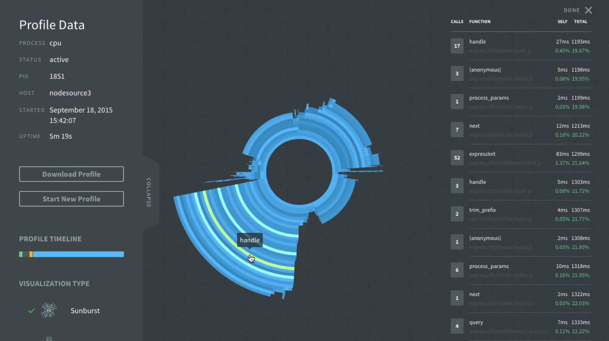
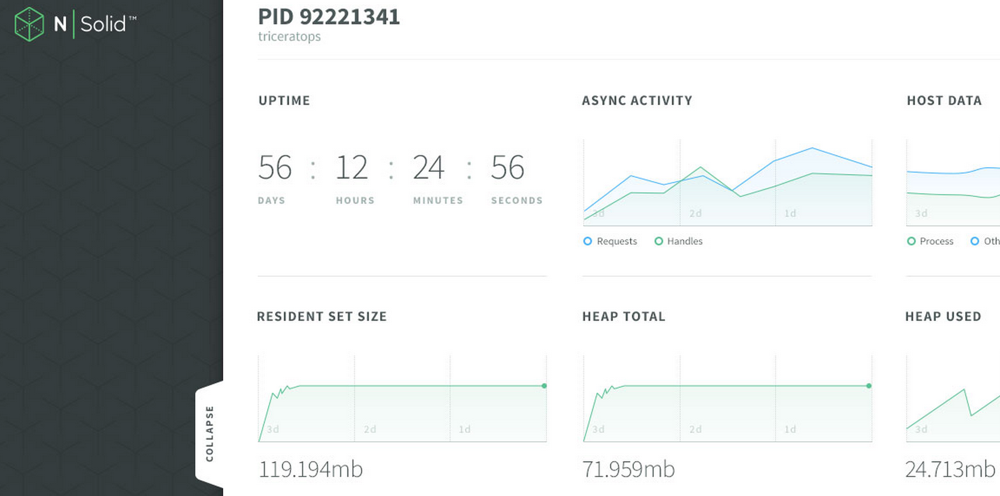
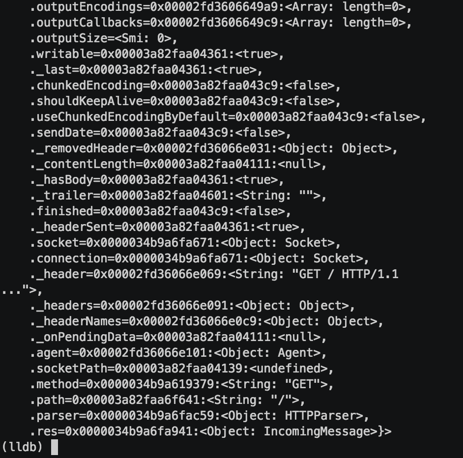

# Debugging/Profiling Node.js

<p style="text-align: center;">
  
</p>
<p style="text-align: center;">
  <small><a href="http://thlorenz.com">Thorsten Lorenz</a></small>
</p>
<p style="text-align: center;">
  <small>twitter <a href="http://twitter.com/thlorenz">@thlorenz</a>  |  github  <a href="http://github/thlorenz">@thlorenz</a>  |  irc  thlorenz</small>
</p>

# The Stack

C/C++         | JavaScript
------------- | -------------
libuv         |
openssl       |   v8
http_parser   |

# The tools

C/C++  (Linux)      | (BSD)             | JavaScript
------------------- | ----------------- | -------------
perf                | dtrace            | debugger
ftrace              | dtruss            | node-inspector (v8-profiler)
strace              | Instruments       | chrome://tracing
ktap                | iotop             |
systemtap           | execsnoop         |
valgrind            | opensnoop         |
iosnoop             | iosnoop           |
execsnoop           | rwssnoop          |
 gdb/lldb           | gdb/lldb          |

- [linux tools details](https://medium.com/@evgenyg/awesome-linux-tools-c30985c248d)
- see all Dtrace tools: `man -k dtrace`


# The Stack is divided

C/C++         | JavaScript
------------- | -------------
libuv         |
openssl       |   v8
http_parser   |

# The tools apply only partially

C/C++  (Linux)      | (BSD)             | JavaScript
------------------- | ----------------- | -------------
perf                | dtrace            | debugger
ftrace              | dtruss            | node-inspector (v8-profiler)
strace              | Instruments       | chrome://tracing
ktap                | iotop             |
systemtap           | execsnoop         |
valgrind            | opensnoop         |
iosnoop             | iosnoop           |
execsnoop           | rwssnoop          |
gdb/lldb            | gdb/lldb          |

# v8 features

 Node.js/v8  | Node.js 0.10 | Node.js 4.1.2
------------ | ------------ | ------------
v8           | v3.14.5.9    | 4.5.103.35

- `—perf-basic-prof` needs v8 >= v3.24

# v8 features

```
// /tmp/perf-<pid>.map

1661472b3740 26 LoadIC:length
1661472b37e0 f4 LazyCompile:~exports.runInThisContext vm.js:52
1661472b3940 192 Stub:FastNewContextStub
1661472b3b40 61c Function:~ /Volumes/d/dev/talks/debugging-profiling-io.js/demos/demo-2/app.js:1
1661472b41c0 b4 Script:~/Volumes/d/dev/talks/debugging-profiling-io.js/demos/demo-2/app.js
1661472b42e0 9c LazyCompile:~require module.js:369
1661472b43e0 18c LazyCompile:~Module.require module.js:348
1661472b45e0 7c Stub:ToBooleanStub(Bool,String)
1661472b46c0 68 Stub:ToBooleanStub(Null,SpecObject)
```

# Sampling Demo


# N|Solid Visualization



# node engine

- libuv is the _powerhouse_ of Node.js
- handles all requests that require system resources
- also implements `setTimeout` and `setInterval`

# node engine

- knowing what requests are in flight or handles are active gives us important insight into our Node.js process
- `process._getActiveHandles`, `process._getActiveRequests` and `async_wrap` hooks allow us to get a hold of them

<!-- notes
- _getAcive* are semi documented, node tracks requests/handles created/destroyed
- async_wrap provides way to hook into initialization and life time events of those requests
-->

# Actives Demo


<!-- notes
- `node active-handles/examples/child_process.exec.js`
- `node active-handles/examples/mixed.js`
- `node active-requests/examples/multi-fs.js`
-->

# N|Solid Integration



# What's on the Horizon

- tracing-wg working with v8 team
  - v8 tracing embedders guide
- Chrome DevTools and `chrome://tracing` improvements
- N|Solid features and research

# What about Debugging

### lldb-jbt


# What about Debugging

### lldb-node

_Even more powerful_



# Userland Modules

- [node-inspector/v8-profiler](https://github.com/node-inspector/v8-profiler)
- [node-inspector/node-inspector](https://github.com/node-inspector/node-inspector)
- [thlorenz/cpuprofilify](https://github.com/thlorenz/rsj)
- [thlorenz/traceviewify](https://github.com/thlorenz/traceviewify)
- [thlorenz/resolve-jit-symbols](https://github.com/thlorenz/resolve-jit-symbols)
- [thlorenz/lldb-jbt](https://github.com/thlorenz/lldb-jbt)
- [indutny/llnode](https://github.com/indutny/llnode)

# Resources Links

- [**tracing-wg**](https://github.com/nodejs/tracing-wg) _Node.js working group dedicated to improve tracebility_
- [**async_wrap**](http://blog.trevnorris.com/) _async wrap explained by its creator @trevnorris_
- [**catapult**](https://github.com/catapult-project/catapult) _home for several performance tools that span from gathering, displaying and analyzing performance data, includes trace-viewer_
- [**Brendan Gregg's homepage**](http://www.brendangregg.com/) _performance blog_
- [**node summit talk**](http://nodesummit.com/media/debugging-node-js-the-double-edged-sword/) _more detailed DTrace demo_

<!-- notes
- tracing-wg include some v8 devs
-->

# NodeSource Tooling

[](https://downloads.nodesource.com/)

_[https://downloads.nodesource.com/](https://downloads.nodesource.com/)_

# Thanks!

<p style="text-align: center;">
  
</p>
<p style="text-align: center;">
  <small><a href="http://thlorenz.com">Thorsten Lorenz</a></small>
</p>
<p style="text-align: center;">
  <small>twitter <a href="http://twitter.com/thlorenz">@thlorenz</a>  |  github  <a href="http://github/thlorenz">@thlorenz</a>  |  irc  thlorenz</small>
</p>
