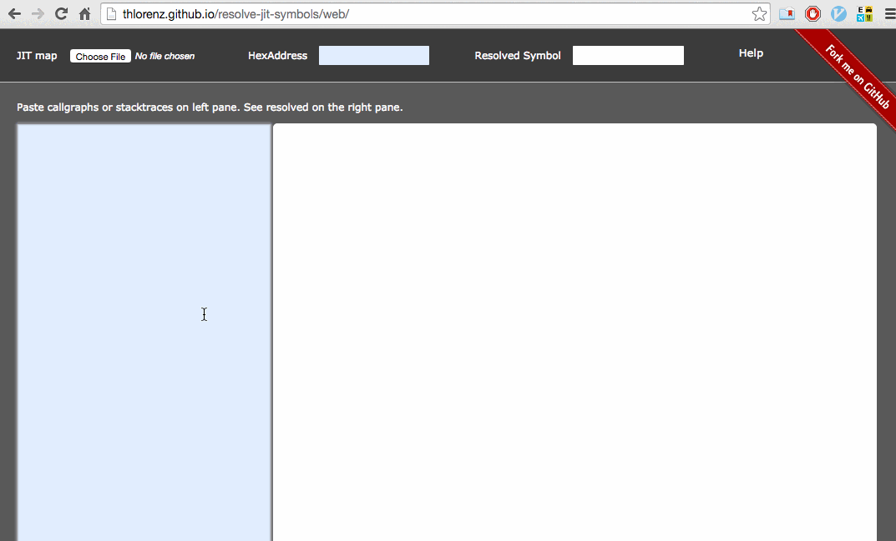
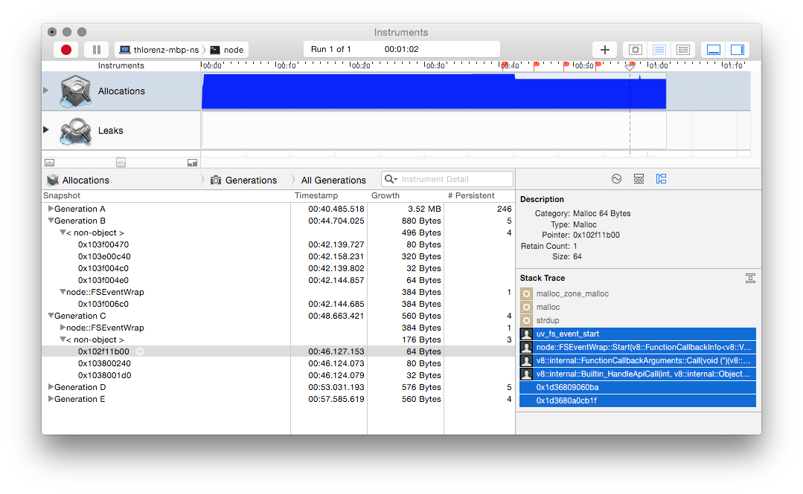
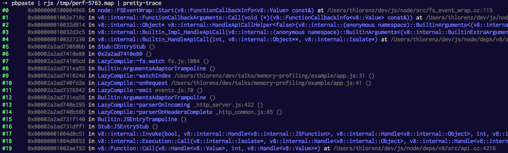
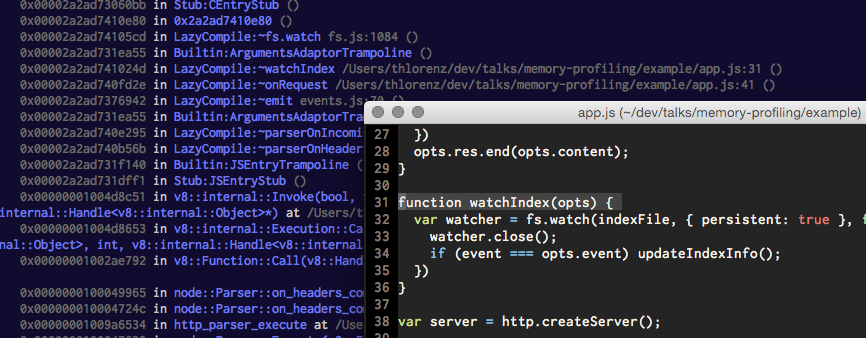

# Look Ma No Assembly!!!


<p style="text-align: center;">
  <small><a href="http://thlorenz.com">Thorsten Lorenz</a></small>
</p>
<p style="text-align: center;">
  <small>twitter <a href="http://twitter.com/thlorenz">@thlorenz</a>  |  github  <a href="http://github/thlorenz">@thlorenz</a>  |  irc  thlorenz</small>
</p>

# Look Ma No Assembly!!!

- **v8** added JIT support available in `node > 0.11.x`
- tools that leverage this currently have shortcomings
- we can write our own tools :)

# Demo 01

<!-- notes 
- server slow, suspect we are reading synchronously
- looking for `fs.readSync` yielded nothing
- could go through code manually
- or set breakpoint 
-->

# Demo Explained

- start **lldb** debugger with target set to `~/dev/js/node/node --perf-basic-prof ./index.js`
- using cloned **node** with `--perf-basic-prof` flag to cause `/tmp/perf-<pid>.map` file to be written

```
lldb -- ~/dev/js/node/node --perf-basic-prof ./index.js
```

# Demo Explained

- start server to let it initialize then break into it to add breakpoints

```
(lldb) r
Process 30239 launched: '/Users/thlorenz/dev/js/node/node_g' (x86_64)
pid 30239
Ctrl-C
```

# Demo Explained

- setting breakpoint on `uv_fs_read` function which gets invoked every time we read from a file
- setting condition `cb==NULL` since that is the case when file is read synchronously

```
(lldb) b -n uv_fs_read -c cb==NULL
(lldb) br l
Current breakpoints:
1: name = 'uv_fs_read', locations = 1, resolved = 1, hit count = 0
Condition: cb==NULL

  1.1: where = node_g`uv_fs_read + 44 at fs.c:1037, address = 0x00000001009c096c, resolved, hit count = 0
(lldb) c
Process 30239 resuming
```

# Demo Explained

- request main page from server which triggers our breakpoint
- this proves we are performing synchronous file reads while serving a request, a big **NO-NO**

```
curl localhost:8000
```

# Demo Explained

- stack traces only show C++/C symbols
- assembly generated from JavaScript is showing hexadecimal memory address only *not very helpful*

```
Process 30239 stopped
* thread #1: tid = 0x88ab5, 0x00000001009c096c node_g`uv_fs_read(loop=0x0000000100f4b980, req=0x00007fff5fbf4fa8, file=21, bufs=0x00007fff5fbf51d0, nbufs=1, off=-1, cb=0x0000000000000000) + 44 at fs.c:1037, queue = 'com.apple.main-thread, stop reason = breakpoint 2.1
    frame #0: 0x00000001009c096c node_g`uv_fs_read(loop=0x0000000100f4b980, req=0x00007fff5fbf4fa8, file=21, bufs=0x00007fff5fbf51d0, nbufs=1, off=-1, cb=0x0000000000000000) + 44 at fs.c:1037
   1034                unsigned int nbufs,
   1035                int64_t off,
   1036                uv_fs_cb cb) {
-> 1037   INIT(READ);
   1038   req->file = file;
   1039
   1040   req->nbufs = nbufs;
(lldb) bt
* thread #1: tid = 0x88ab5, 0x00000001009c096c node_g`uv_fs_read(loop=0x0000000100f4b980, req=0x00007fff5fbf4fa8, file=21, bufs=0x00007fff5fbf51d0, nbufs=1, off=-1, cb=0x0000000000000000) + 44 at fs.c:1037, queue = 'com.apple.main-thread, stop reason = breakpoint 2.1
  * frame #0: 0x00000001009c096c node_g`uv_fs_read(loop=0x0000000100f4b980, req=0x00007fff5fbf4fa8, file=21, bufs=0x00007fff5fbf51d0, nbufs=1, off=-1, cb=0x0000000000000000) + 44 at fs.c:1037
    frame #1: 0x00000001009343ce node_g`node::Read(args=0x00007fff5fbf52b0) + 1502 at node_file.cc:922
    frame #2: 0x000000010024be4c node_g`v8::internal::FunctionCallbackArguments::Call(this=0x00007fff5fbf53b0, f=0x0000000100933df0)(v8::FunctionCallbackInfo<v8::Value> const&)) + 124 at arguments.cc:33
    frame #3: 0x00000001002925d4 node_g`v8::internal::Object* v8::internal::HandleApiCallHelper<false>(args=BuiltinArguments<1> at 0x00007fff5fbf54c8, isolate=0x0000000102004c00)::BuiltinArguments<(v8::internal::BuiltinExtraArguments)1>, v8::internal::Isolate*) + 1348 at builtins.cc:1127
    frame #4: 0x0000000100292085 node_g`v8::internal::Builtin_Impl_HandleApiCall(args=v8::internal::<anonymous namespace>::HandleApiCallArgumentsType at 0x00007fff5fbf5510, isolate=0x0000000102004c00)::BuiltinArguments<(v8::internal::BuiltinExtraArguments)1>, v8::internal::Isolate*) + 53 at builtins.cc:1144
    frame #5: 0x000000010028bef0 node_g`v8::internal::Builtin_HandleApiCall(args_length=7, args_object=0x00007fff5fbf55d0, isolate=0x0000000102004c00) + 80 at builtins.cc:1143
    frame #6: 0x00003d278f8060bb
    frame #7: 0x00003d278f8b055b
    frame #8: 0x00003d278f81ea55
    frame #9: 0x00003d278f8adb68
    [..] 
```

# Demo Explained

- **`perf-<pid>.map`** file contains mappings from hexacecimal addresses to *JavaScript symbols*

```
Address      Size  Symbol
[..]
3d278f93dfc0 f Stub:CallSiteStrictModeKey
3d278f93e040 25 LoadIC:CallSiteStrictModeKey
3d278f93e0e0 288 LazyCompile:~Error.prepareStackTrace /Users/thlorenz/dev/js/projects/flush-all/node_modules/bindings/bindings.js:110
3d278f93e3e0 d4 LazyCompile:~CallSiteGetFileName native messages.js:603
3d278f93e520 38 KeyedLoadIC:symbol("CallSite#function" hash 3ad206a7)
3d278f93e5c0 33 Stub:name
3d278f93e660 25 LoadIC:name
3d278f93e700 3a0 LazyCompile:~getRoot /Users/thlorenz/dev/js/projects/flush-all/node_modules/bindings/bindings.js:145
3d278f93eb00 2f0 LazyCompile:~posix.join path.js:496
3d278f93ee60 f Stub:BinaryOpICWithAllocationSiteStub(ADD_CreateAllocationMementos:String*String->String)
3d278f93eee0 25 LoadIC:length
3d278f93ef80 25 LoadIC:isString
[..]
```

# Demo Explained

- we can resolve these addresses from the `/tmp/perf-<pid>.map` with help of [resolve-jit-symbols](https://github.com/thlorenz/resolve-jit-symbols)

```
pbpaste | rjs perf-<pid>.map
```

# Demo Explained

- we can make it a bit more readable with [pretty-trace](https://github.com/thlorenz/pretty-trace)

```
pbpaste | rjs perf-<pid>.map | pretty-trace
```

# Demo Explained

- alternatively we can use the [resolve-jit-symbols web app](http://thlorenz.github.io/resolve-jit-symbols/web/) to
  paste the stack and load the map file to show the resolved trace



# Demo 01 Again

- this time without a terminal ;)

# Debug Symbols

- are included in the binaries and object files at compile time
- compiler is aware what assembly gets generated from which code and thus can provide that information

# Inspecting Debug Symbols

## symbols

- spits out symbols found inside which show mapping from hex address to function name and location in file

```
symbols <executable>
```

```
 # address            size    symbol
0x000000000002a7d0 (    0x2f) v8::internal::Internals::GetRoot(v8::Isolate*, int) [FUNC, EXT, LENGTH, NameNList, MangledNameNList, Merged, NList, Dwarf]
                0x000000000002a7d0 (     0xb) v8.h:6219
                0x000000000002a7db (     0xf) v8.h:6220
                0x000000000002a7ea (    0x15) v8.h:6221
```

# Inspecting Debug Symbols


## dsymutil

- extracts symbols from executable and info from object files into a DWARF file inside a `.dSYM`

```
dsymutil <executable>
```

# Inspecting Debug Symbols

## dwarfdump

- spits out symbols info in DWARF format including return type and parameter info with **DIE**s *Debugging
Information Entry* for each function

```
dwarfdump <executable|dwarf file>
```

```
0x00000624:                 TAG_subprogram [6] *
                             AT_MIPS_linkage_name( "_ZN2v88internal9Internals7GetRootEPNS_7IsolateEi" )
                             AT_name( "GetRoot" )
                             AT_decl_file( "../../deps/v8/include/v8.h" )
                             AT_decl_line( 6218 )
                             AT_type( {0x00007602} ( Object** ) )
                             AT_declaration( 0x01 )
                             AT_external( 0x01 )
                             AT_accessibility( DW_ACCESS_public )

0x00000637:                     TAG_formal_parameter [8]  
                                 AT_type( {0x00007640} ( Isolate* ) )

0x0000063c:                     TAG_formal_parameter [8]  
                                 AT_type( {0x000075fb} ( int ) )

0x00000641:                     NULL
```

# Inspecting Debug Symbols

## atos

- converts numeric addresses to symbols of binary images or processes

```
atos -o <executable|static lib|obj file> -printHeader <hexaddress>
```

```
➝  atos  -o out/Debug/obj/src/node.uv.o 0x00000624
node::uv::Initialize(v8::Handle<v8::Object>, v8::Handle<v8::Value>, v8::Handle<v8::Context>) (in node.uv.o) (uv.cc:59)
```

# JIT

- is compilation done during *execution* of a program
- **v8** generates machine code on the fly and thus cannot provide symbols before hand
- therefore it needs to provide *symbol* and *mapping* information as it is *JIT*ing the code

# v8 JIT support

## perf-jit

- map file written to `/tmp/perf-<pid>.jit`
- contains simple location information
- does not contain information about parameters

# v8 JIT support

## gdb-jit

- generates more detaild JIT info to be consumed by gdb or lldb debuggers
- conformed to ELF (Linux) or MachO (OSX) object format standards

<!-- notes
TODO: 
- lldb master on Linux most times can resolve symbols like this
- so can gdb
- both are unstable and slow
-->

# v8 JIT support

```cpp
// v8/src/log.cc
const char PerfBasicLogger::kFilenameFormatString[] = "/tmp/perf-%d.map";
[..]
void PerfBasicLogger::LogRecordedBuffer(Code* code,
                                       SharedFunctionInfo*,
                                       const char* name,
                                       int length) {
  DCHECK(code->instruction_start() == code->address() + Code::kHeaderSize);

  base::OS::FPrint(perf_output_handle_, "%llx %x %.*s\n",
                   reinterpret_cast<uint64_t>(code->instruction_start()),
                   code->instruction_size(), length, name);
}
```

# Flushing `perf-<pid>.map`

- need to flush once we've seen/run all JS we are interested in
- three different ways to make that happen

# Flushing `perf-<pid>.map`

#### Apply v8 Patch

- most intrusive but easiest to work with once applied
- **guarantees all** *JIT* info is written **immediately**

```patch
diff --git a/deps/v8/src/log.cc b/deps/v8/src/log.cc
index 0dcf6bb..4d9280c 100644
--- a/deps/v8/src/log.cc
+++ b/deps/v8/src/log.cc
@@ -291,6 +291,7 @@ void PerfBasicLogger::LogRecordedBuffer(Code* code,
   base::OS::FPrint(perf_output_handle_, "%llx %x %.*s\n",
                    reinterpret_cast<uint64_t>(code->instruction_start()),
                    code->instruction_size(), length, name);
+  fflush(perf_output_handle_);
 }

```

# Flushing `perf-<pid>.map`

### flush all

#### Create a `/flush` route

- `curl` to `localhost:PORT/fulsh` to trigger flushing all buffers including `perf-<pid>.map`
- allows manual flush while process is running

```js
var flushall = require('flush-all');

function onrequest(req, res) {
  if (req.url === '/flush') {
    flushall();
    res.writeHead(200);
    res.end();
  }
  [..]
}
```

# Flushing `perf-<pid>.map`

#### Handle **SIGTERM**

- intercept `SIGTERM` and ensure your server closes and process exits cleanly
- otherwise process exists without file ever being flushed
- optionally we may call `flushall` here as well but that is probably not needed
- disadvantage is that process has to exit to get map file

```js
function onSIGTERM() {
  server.close();
  process.exit(0);
}

process.on('SIGTERM', onSIGTERM);
```

# Demo 02

- tracking memory leak

# Demo 02 Results

- we were able to show a leak even on C++ end with Instruments



# Demo 02 Results

- the below is the trace we copied which showed two addresses of assembly instructions that we resolved with
  **resolve-jit-symbols** 

```
   3 node uv_fs_event_start /Users/thlorenz/dev/js/node/deps/uv/src/unix/kqueue.c:351
   4 node node::FSEventWrap::Start(v8::FunctionCallbackInfo<v8::Value> const&) /Users/thlorenz/dev/js/node/src/fs_event_wrap.cc:123
   5 node v8::internal::FunctionCallbackArguments::Call(void (*)(v8::FunctionCallbackInfo<v8::Value> const&)) /Users/thlorenz/dev/js/node/deps/v8/src/arguments.cc:33
   6 node v8::internal::Builtin_HandleApiCall(int, v8::internal::Object**, v8::internal::Isolate*) /Users/thlorenz/dev/js/node/deps/v8/src/builtins.cc:1127
   7  0x1d36809060ba
   8  0x1d3680a0cb1f
```

# Demo 02 Results

- not much JS in the trace, but enough for us to know where to put a breakpoint in case we want to switch to
  *node-inspector*

```
➝  pbpaste | rjs /tmp/perf-99248.map
   3 node uv_fs_event_start /Users/thlorenz/dev/js/node/deps/uv/src/unix/kqueue.c:351
   4 node node::FSEventWrap::Start(v8::FunctionCallbackInfo<v8::Value> const&) /Users/thlorenz/dev/js/node/src/fs_event_wrap.cc:123
   5 node v8::internal::FunctionCallbackArguments::Call(void (*)(v8::FunctionCallbackInfo<v8::Value> const&)) /Users/thlorenz/dev/js/node/deps/v8/src/arguments.cc:33
   6 node v8::internal::Builtin_HandleApiCall(int, v8::internal::Object**, v8::internal::Isolate*) /Users/thlorenz/dev/js/node/deps/v8/src/builtins.cc:1127
   7  Stub:CEntryStub
   8  LazyCompile:~FSWatcher.start fs.js:1069
```

# Demo 02 Results

- but we were able to do better ...

# Demo 02 Results

- added a breakpoint inside `FSEventWrap::Start` in Xcode and copied the stack on the left


# Demo 02 Results

- piped that through **resolve-jit-symbols** and **pretty-trace** to get good insight where our problem came from



# Demo 02 Results

- even were able to click on the file to lead us right to the culprit




# Flamegraphs

- same techniques can be used to resolve symbols in a call graph
- [flamegraph](https://github.com/thlorenz/flamegraph) supports loading a `perf-<pid>.map` file to resolve symbols

# Demo 03

- flamegraph

# Tools

- [resolve-jit-symbols](https://github.com/thlorenz/resolve-jit-symbols) `cat stack.txt | rjs /tmp/perf-<pid>.map` (make sure to run your app with `--perf-basic-prof`
- [pretty-trace](https://github.com/thlorenz/pretty-trace) `cat stack.txt | pretty-trace` results in readable stack
- [trance](https://github.com/thlorenz/trance) `cat stack.txt | trance` **TRA**ce enha**NCE**r which resolves locations and
  optionally inlines relevant code 
- [flamegraph](https://github.com/thlorenz/flamegraph)  flamegraphs without the *Perl* and and added support for
  `perf-<pid>.map` files

# Thanks!

<p style="text-align: center;">
  
</p>
<p style="text-align: center;">
  <small><a href="http://thlorenz.com">thorsten lorenz</a></small>
</p>
<p style="text-align: center;">
  <small>twitter <a href="http://twitter.com/thlorenz">@thlorenz</a>  |  github  <a href="http://github/thlorenz">@thlorenz</a>  |  irc  thlorenz</small>
</p>
