# Memory Profiling For Mere Mortals

#### Or why Bobby Shouldnt be so Greedy


# Memory Profiling For Mere Mortals

<p style="text-align: center;">
  
</p>
<p style="text-align: center;">
  <small><a href="http://thlorenz.com">Thorsten Lorenz</a></small>
</p>
<p style="text-align: center;">
  <small>twitter <a href="http://twitter.com/thlorenz">@thlorenz</a>  |  github  <a href="http://github/thlorenz">@thlorenz</a>  |  irc  thlorenz</small>
</p>

# Toy Story

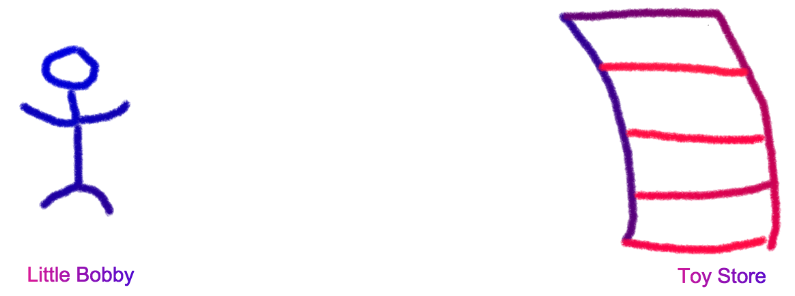

# Toy Story


# Toy Story


# Toy Story


# Toy Story

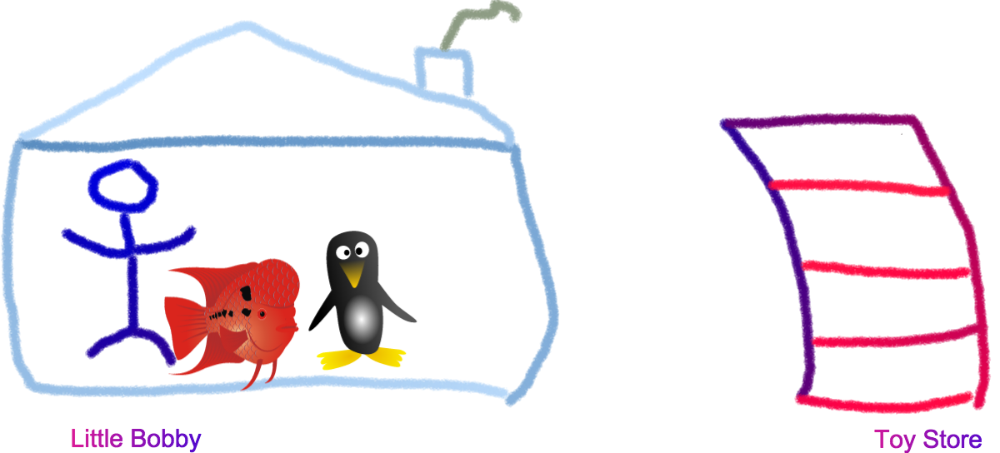

# Toy Story

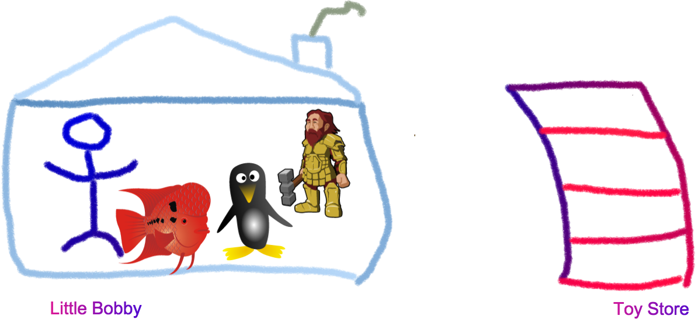

# Toy Story


# Toy Story


# Toy Story


# Toy Story

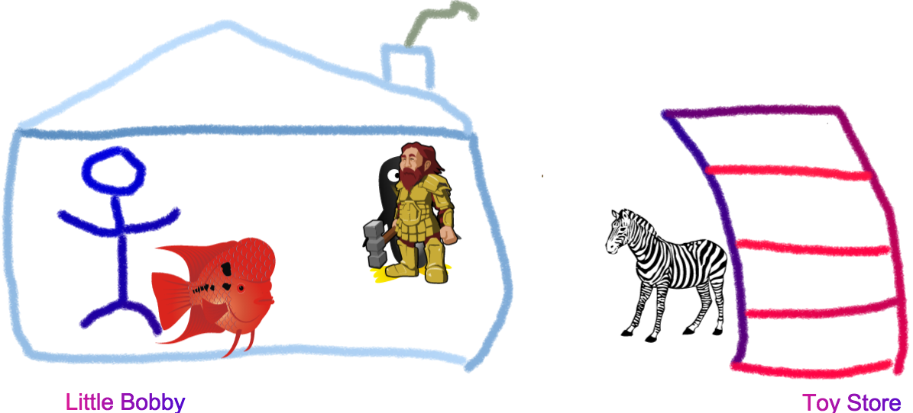

# Toy Story


# Toy Story


# Toy Story


# Toy Story


<!--
- triceratops (threehorned dinosaur)
-->

# Toy Story


# Toy Story


# Toy Story

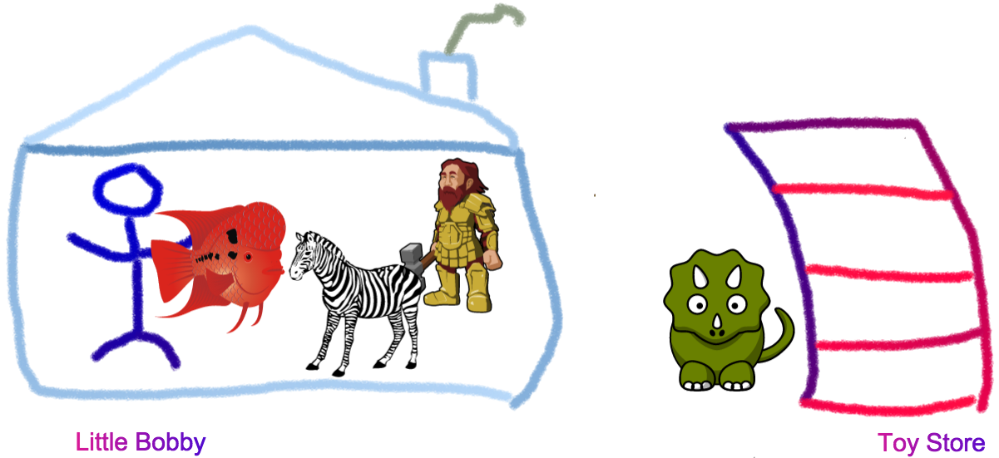

# Toy Story


# HUH?


# Server

```js
const http = require('http')
const fs   = require('fs')
const path = require('path')
const templateEngine = require('any-template-engine')

const header = fs.readFileSync(path.join(__dirname, 'my-header.html'), 'utf8')

// [ ...]

function onrequest(req, res) {
  const context = getContext(req);

  fs.readFile(path.join(__dirname, 'index.html'), 'utf8', function onreadIndex(err, src) {
    if (err) return console.error(err)
    const html = header + templateEngine(src, context)
    serve(html)
  })
}
```


# Server

## House and Chimney

```js
const http = require('http')
const fs   = require('fs')
const path = require('path')
const templateEngine = require('any-template-engine')

const header = fs.readFileSync(path.join(__dirname, 'my-header.html'), 'utf8')
```

# Server

## House and Chimney

```js
const http = require('http')
const fs   = require('fs')
const path = require('path')
const templateEngine = require('any-template-engine')

const header = fs.readFileSync(path.join(__dirname, 'my-header.html'), 'utf8')
```

- `require`d modules and static header are **created once** and stay in memory for the life time of the server

<!-- notes
- these are shared for each processed request
-->

# Server

## Toys

```js
function onrequest(req, res) {
  const context = getContext(req);

  fs.readFile(path.join(__dirname, 'index.html'), 'utf8', function onreadIndex(err, src) {
    if (err) return console.error(err)
    const html = header + templateEngine(src, context)
    serve(html)
  })
}
```

# Server

## Toys

```js
function onrequest(req, res) {
  const context = getContext(req);

  fs.readFile(path.join(__dirname, 'index.html'), 'utf8', function onreadIndex(err, src) {
    if (err) return console.error(err)
    const html = header + templateEngine(src, context)
    serve(html)
  })
}
```

- resources like `context` and `src` of `index.html` are **created for each request**

# Server

## Toys

```js
function onrequest(req, res) {
  const context = getContext(req);

  fs.readFile(path.join(__dirname, 'index.html'), 'utf8', function onreadIndex(err, src) {
    if (err) return console.error(err)
    const html = header + templateEngine(src, context)
    serve(html)
  })
}
```

- resources like `context` and `src` of `index.html` are **created for each request**
- should not stay in memory after processing request is finished **either with success or failure**

# Memory Leak

> In an environment in which memory is managed by a garbage collector, a memory leak occurs when references to objects
> are retained even though they are no longer needed by your program.

# Memory Leak

> In an environment in which memory is managed by a garbage collector, a memory leak occurs when references to objects
> are retained even though they are no longer needed by your program.

- especially bad if those objects are created during an action that is repeated often, like serving a request

# Memory Leak

> In an environment in which memory is managed by a garbage collector, a memory leak occurs when references to objects
> are retained even though they are no longer needed by your program.


<!-- notes
- if Bobby was to hold on to each fish he gets and keep them in an aquarium itd flow over at some point
-->

# Memory Leak

> Im not Bobby, I release what I no longer need

# Memory Leak


# Memory Leak Causes

1. registered event handlers

<!-- notes
- specifically relating to node
- in the browser its different (mostly DOM nodes hanging around)
-->

# Memory Leak Causes

1. registered event handlers
2. function closures

# Memory Leak Causes

1. registered event handlers
2. function closures
3. function closures

# Memory Leak Causes

1. registered event handlers
2. function closures
3. function closures
4. leaking connections

<!-- notes
- i.e. when a request fails but the connection isnt properly cleaned up
-->

# Garbage Collector

- follows *retaining path* from a *GC root* to an object
- if no such path exists, object is **unreachable** and subject to being collected

# Garbage Collector

- what is a *Root* and that *retaining path* you speak about?


# Garbage Collector


[devtools/javascript-memory-profiling](https://developer.chrome.com/devtools/docs/javascript-memory-profiling)

# Garbage Collector


- node **1** is the *Root* node that *dominates* all other nodes

# Garbage Collector


- node **8** and **7** reference no other nodes, their *retaining size* is equal to their *shallow size*
- node **6** retains node **8**, therefore its *retaining size* is the it's own *shallow size* plus the *retaining size* of node **8**

# Garbage Collector


- nodes **9** and **10** are not reachable via the *Root* node and therefore are orphaned and subject to garbage
  collection

# Garbage Collector


- if we keep referencing nodes we no longer need we got ourselves a memory leak

# Trouble Shooting Leaks

1. Reproduce (sometimes watching process with *top* suffices)

# Trouble Shooting Leaks

## Demo Time


<!-- notes
- crash process
- increasing memory by itself doesnt prove leak until it hits 1.5GB
- increasing memory although we repeatedly trigger garbage collection indicates a leak
- only once you reach 1.5G do you prove you have a leak since v8 is does not aggressively collect for perf reasons
- 1.5GB is heap allocated by v8 per Isolate, i.e. Tab or in our case Node.js process
-->

# Trouble Shooting Leaks

1. Reproduce (sometimes watching process with *top* suffices)
2. Isolate and find Culprit by profiling via `node --inspect` and *DevTools*

# Inspecting with Chrome DevTools

Relies on `--inspect` option which arrrived with node v6

```
> node -v
v4.6.2

> node --inspect
node: bad option: --inspect
```

# Inspecting with Chrome DevTools

<blockquote width="50%" class="twitter-tweet" data-lang="en"><p lang="en" dir="ltr">Node 4 LTS end of life is today; please migrate to a newer version, and remember to test for breakage before deploying.<a href="https://t.co/EpqIA3CNGN">https://t.co/EpqIA3CNGN</a> <a href="https://t.co/23I2skvqcu">pic.twitter.com/23I2skvqcu</a></p>&mdash; Bradley Farias (@bradleymeck) <a href="https://twitter.com/bradleymeck/status/990972497427357696?ref_src=twsrc%5Etfw">April 30, 2018</a></blockquote>
<script async src="https://platform.twitter.com/widgets.js" charset="utf-8"></script>

_Shouldn't be running Node.js <v6 anymore anyways_

# Inspecting with Chrome DevTools

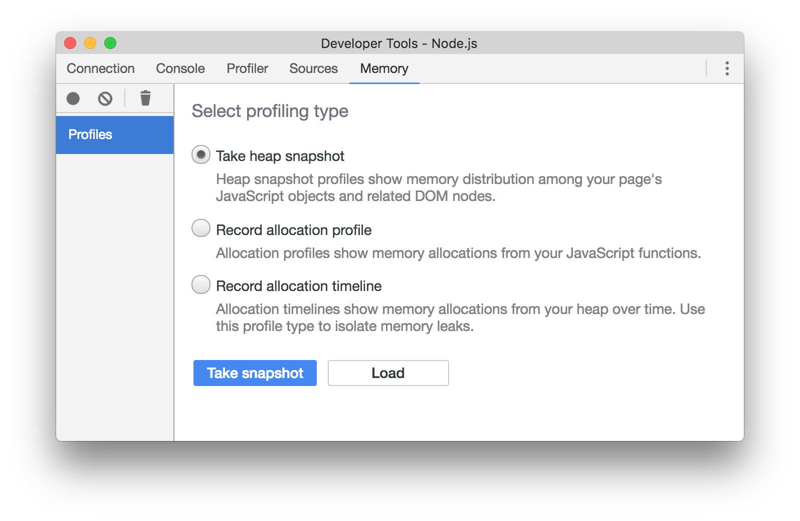

- take snapshots via _Take Snapshot_ button and _red circle_ on upper right

# Inspecting with Chrome DevTools

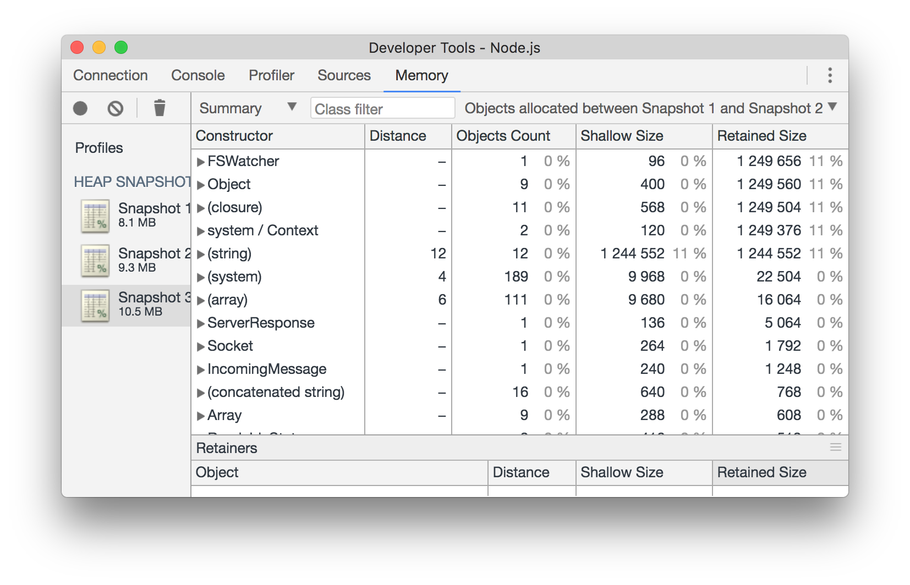

- look at objects still present in snapshot 3 that were created in between snapshot 1 and 2

# Inspecting with Chrome DevTools

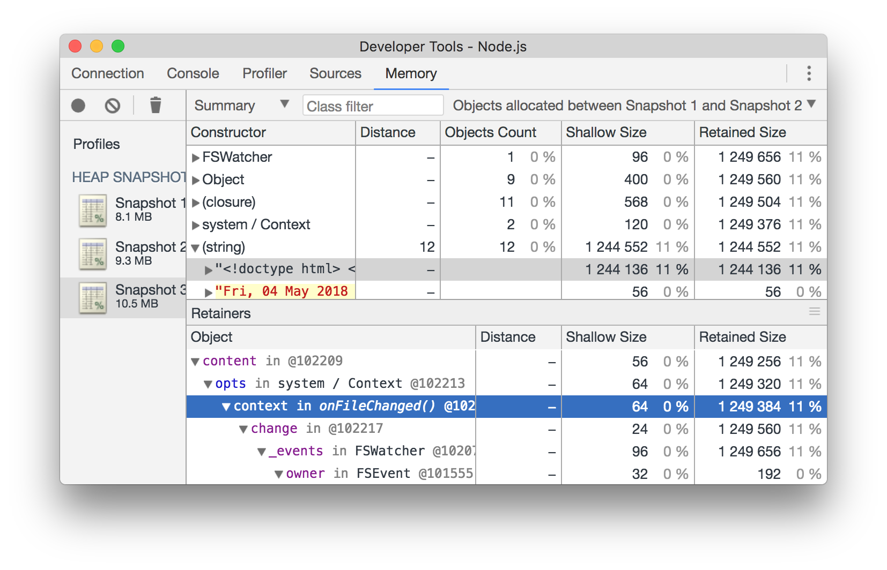

- dig in to find the culprit

# Trouble Shooting Leaks

## Steps

1. Take *bottom line* snapshot *Checkpoint 1*
2. Perform operation that might cause a leak followed by GC
3. Take snapshot *Checkpoint 2*
4. Perform same operation as in *2.* followed by GC
5. Take snapshot *Checkpoint 3*
6. Repeat as often as you want in order to collect as many snapshots as you need

# Trouble Shooting Leaks

## Demo Time


<!-- notes
- DevTools using heapdump module or `inspect`
  - show Object Allocation Tracker
  - show closures
  - show retainer view
  - mention function closures problem
  - mention naming function declarations to show up in heapdump

- functions shown in DevTools are closing over allocated objects and prevent them from being collected

-->

# Trouble Shooting Leaks

1. Reproduce (sometimes watching process with *top* suffices)
2. Isolate and find Culprit by profiling via `node --inspect` and *DevTools*
3. Fix the Leak :) [example code](https://github.com/thlorenz/talks/tree/gh-pages/memory-profiling.2018/app)

# Considerations


- V8 has gotten much better at naming your functions for you
- regardless, properly naming your functions is good practice

# Name Your Functions


# Name Your Functions


# Name Your Functions

```js
const create = function () {}
```

# Name Your Functions


# Name Your Functions

```js
const create = function () {}
```

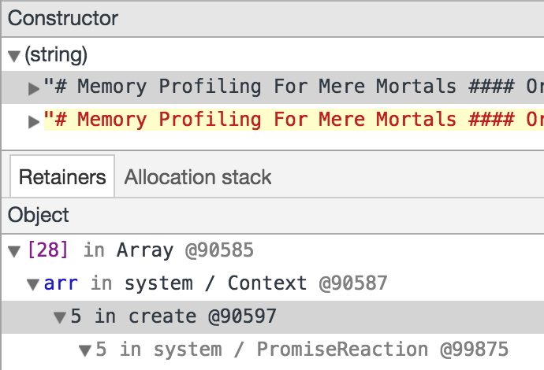

_Well, actually it's fine now ..._

# Name Your Functions

```js
Creator.prototype.create = function () {}
```

# Name Your Functions


# Name Your Functions

```js
Creator.prototype.create = function () {}
```

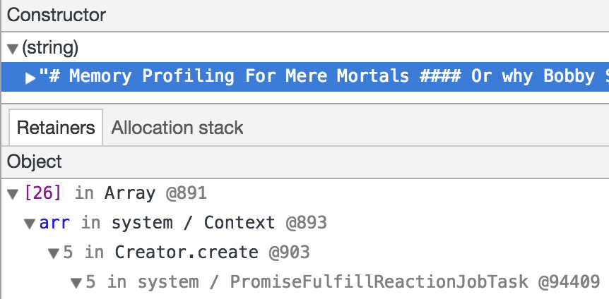

_Well, actually it's fine now ..._

# Name Your Functions

```js
class Creator {
  create(arr) { /* ... */ }
}
```

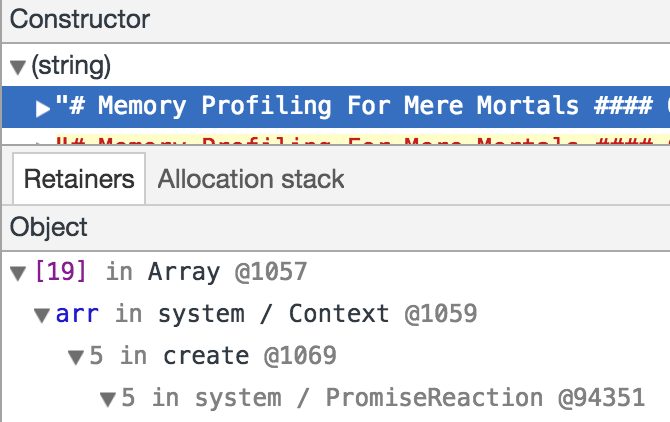

_Also with classes ..._

# Name Your Functions

```js
go(file, function (err, src) { /* ... */ })
```

# Name Your Functions


# Name Your Functions

```js
go(function (err, src) { /* ... */ })
```

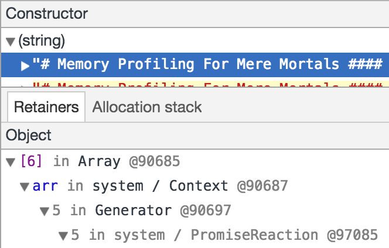

_That is a bad idea still ..._

# Name Your Functions

```js
go(function (err, src) { /* ... */ })
```

```js
go(function create(err, src) { /* ... */ })
```

# Name Your Functions

```js
go((err, src) => { /* .. /* })
```

# Name Your Functions

```js
go((err, src) => { /* .. */ })
```


# Name Your Functions

```js
go((err, src) => { /* .. */ })
```


# Name Your Functions

```js
go((err, src) => { /* .. */ })
```

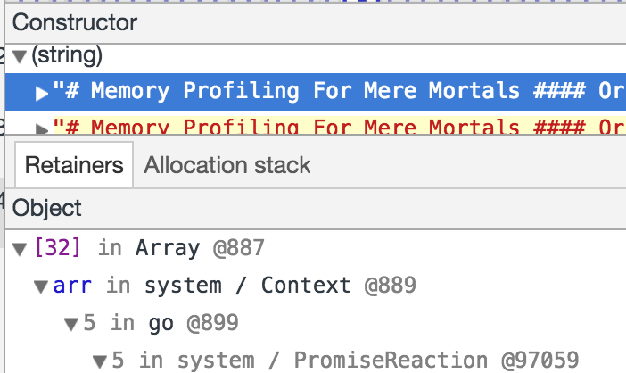

_Actually it's better now, but not great ..._

# Name Your Functions

```js
const create = (err, src) => { /* .. */ }
go(create)
```

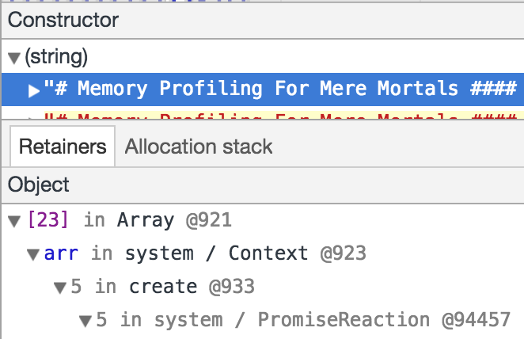

_This is much better ..._

# Recording Allocation Profile

```
> node --inspect
Debugger listening on ws://127.0.0.1:9229/a42a3588-f89f-4c2d-87e8-0b22da716e37
For help, see: https://nodejs.org/en/docs/inspector
```

Then open a _Open dedicated DevTools for Node_ via [chrome://inspect](chrome://inspect)


# Recording Allocation Profile

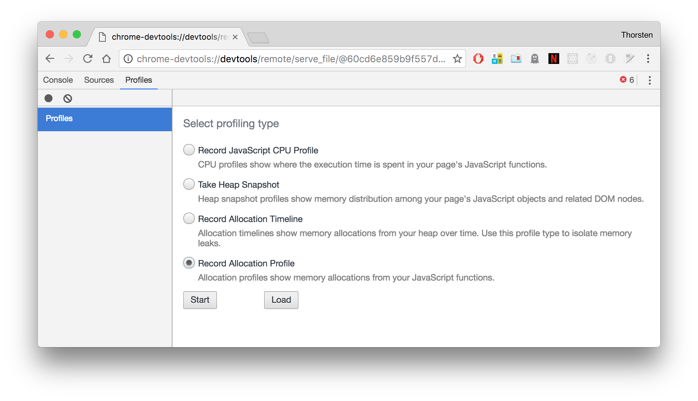

# Recording Allocation Profile


- shows which functions _allocated_ most memory

# Recording Allocation Profile

## Demo Time


<!-- notes
- start same app
- start recording allocation profile
- curl a few times and show result after stopping the recording
-->

# Recording Allocation Profile

#### Recording Allocation Profile with Node.js Programatically

- the [sampling-heap-profiler](https://github.com/v8/sampling-heap-profiler) package allows to
  trigger and stop heap samples programatically and write them to a file
- supposed to be lightweight enough for in-production use on servers
- generated snapshots can be saved offline, and be opened in DevTools later

# Recording Allocation Timeline

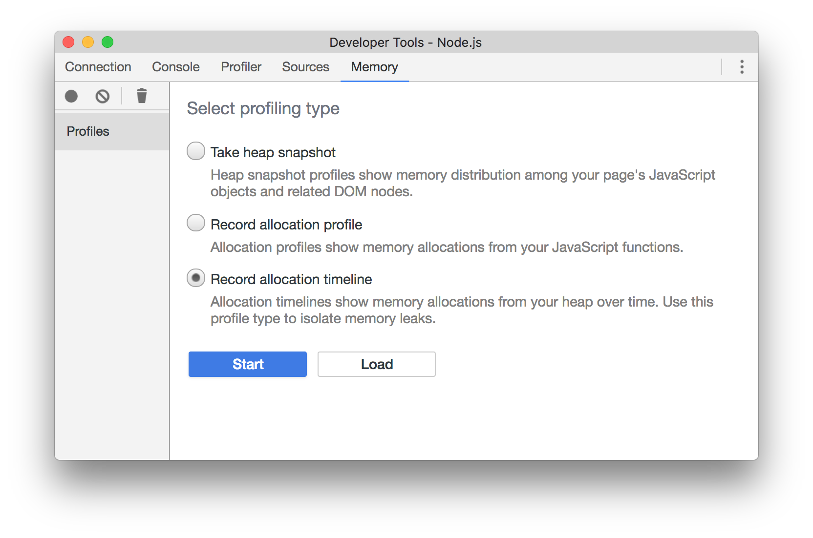

# Recording Allocation Timeline

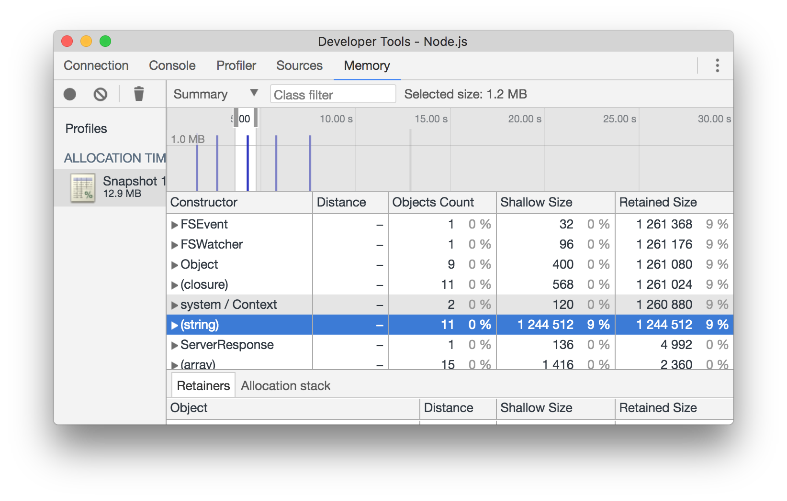

- tracks memory being allocated in real time
- allocated objects can be inspected similar to heap snapshots

# Demo Time


# Resources

### [github.com/thlorenz/v8-perf](https://github.com/thlorenz/v8-per)

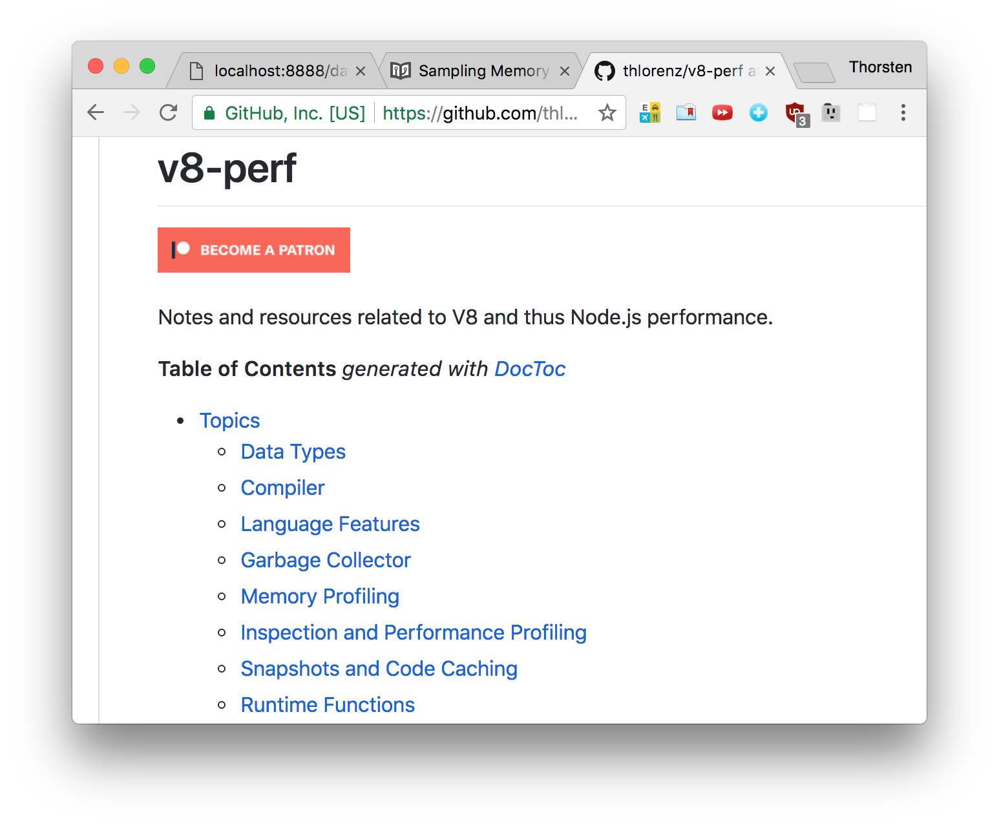

- [garbage collector](https://github.com/thlorenz/v8-perf/blob/master/gc.md)
- [memory profiling](https://github.com/thlorenz/v8-perf/blob/master/memory-profiling.md)

# Thanks!

<p style="text-align: center;">
  
</p>
<p style="text-align: center;">
  <small><a href="http://thlorenz.com">thorsten lorenz</a></small>
</p>
<p style="text-align: center;">
  <small>twitter <a href="http://twitter.com/thlorenz">@thlorenz</a>  |  github  <a href="http://github/thlorenz">@thlorenz</a>  |  irc  thlorenz</small>
</p>
