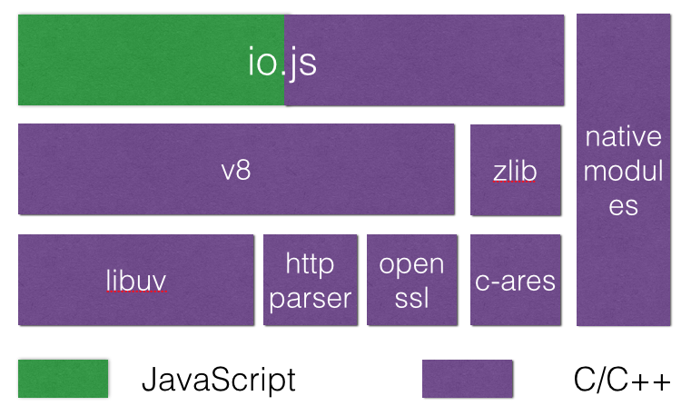
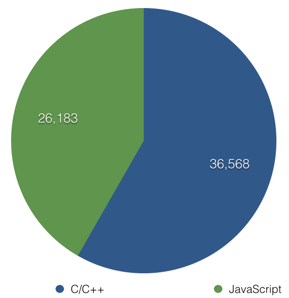
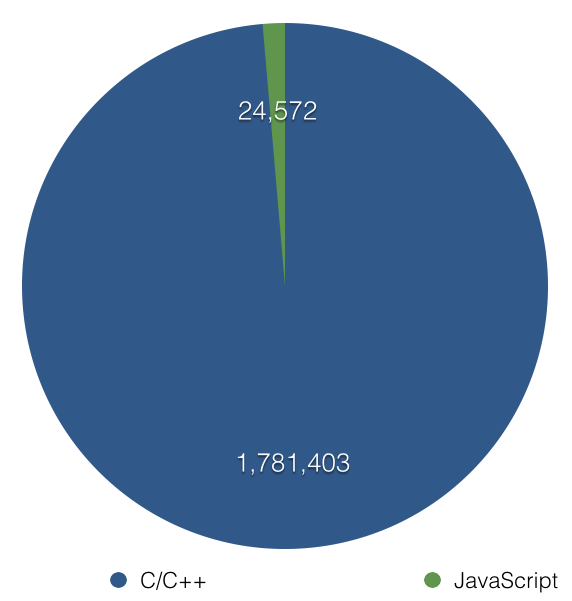
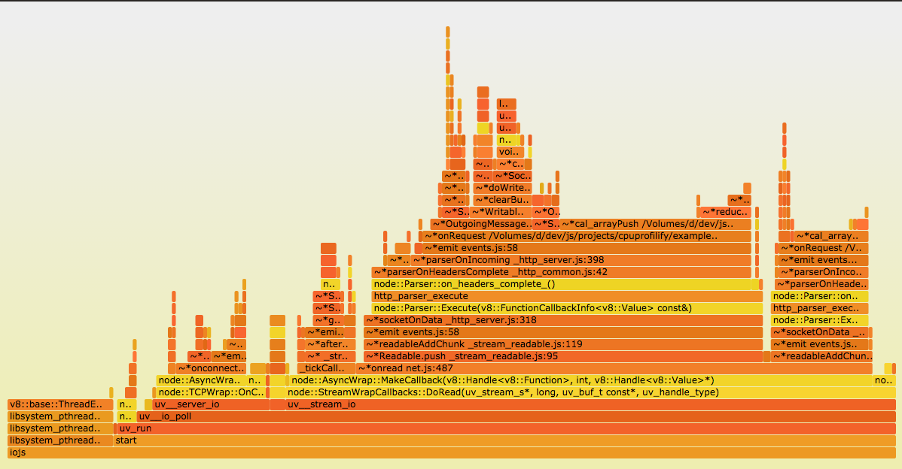

# Node Ain't Just JS

*Profiling and Debugging the Entire Stack*

<p style="text-align: center;">
  
</p>
<p style="text-align: center;">
  <small><a href="http://thlorenz.com">Thorsten Lorenz</a></small>
</p>
<p style="text-align: center;">
  <small>twitter <a href="http://twitter.com/thlorenz">@thlorenz</a>  |  github  <a href="http://github/thlorenz">@thlorenz</a>  |  irc  thlorenz</small>
</p>

# io.js stack



# io.js languages



# io.js deps languages



<!-- notes
- (w/out npm and v8/{tests,tools})
-->

# debug symbols

- are included in the binaries and object files at compile time
- compiler is aware what assembly gets generated from which code and thus can provide that information

# inspecting debug symbols

## dwarfdump

- spits out symbols info in DWARF format including return type and parameter info with **DIE**s *Debugging
Information Entry* for each function

```
dwarfdump <executable|dwarf file>
```

```
0x00000624:                 TAG_subprogram [6] *
                             AT_MIPS_linkage_name( "_ZN2v88internal9Internals7GetRootEPNS_7IsolateEi" )
                             AT_name( "GetRoot" )
                             AT_decl_file( "../../deps/v8/include/v8.h" )
                             AT_decl_line( 6218 )
                             AT_type( {0x00007602} ( Object** ) )
                             AT_declaration( 0x01 )
                             AT_external( 0x01 )
                             AT_accessibility( DW_ACCESS_public )

0x00000637:                     TAG_formal_parameter [8]
                                 AT_type( {0x00007640} ( Isolate* ) )

0x0000063c:                     TAG_formal_parameter [8]
                                 AT_type( {0x000075fb} ( int ) )

0x00000641:                     NULL
```
# JIT

- is compilation done during *execution* of a program
- **v8** generates machine code on the fly and thus cannot provide symbols before hand
- therefore it needs to provide *symbol* and *mapping* information as it is *JIT*ing the code


# v8 features

|         | Node.js 0.10  | Node.js 0.12  |   io.js 1.6.2 |
|---------|---------------|---------------|---------------|
|   v8    | v3.14.5.9     | v3.28.73      |   v4.1.0.15   |


- `—perf-basic-prof` >= v3.24
- \0/
# v8 JIT support perf-jit

- map file written to `/tmp/perf-<pid>.jit`
- contains simple location information
- does not contain information about parameters

# v8 JIT support

## **`perf-<pid>.map`**

- file contains mappings from hexacecimal addresses to *JavaScript symbols*

```
Address      Size  Symbol
[..]
3d278f93dfc0 f Stub:CallSiteStrictModeKey
3d278f93e040 25 LoadIC:CallSiteStrictModeKey
3d278f93e0e0 288 LazyCompile:~Error.prepareStackTrace /Users/thlorenz/dev/js/projects/flush-all/node_modules/bindings/bindings.js:110
3d278f93e3e0 d4 LazyCompile:~CallSiteGetFileName native messages.js:603
3d278f93e520 38 KeyedLoadIC:symbol("CallSite#function" hash 3ad206a7)
3d278f93e5c0 33 Stub:name
3d278f93e660 25 LoadIC:name
3d278f93e700 3a0 LazyCompile:~getRoot /Users/thlorenz/dev/js/projects/flush-all/node_modules/bindings/bindings.js:145
3d278f93eb00 2f0 LazyCompile:~posix.join path.js:496
3d278f93ee60 f Stub:BinaryOpICWithAllocationSiteStub(ADD_CreateAllocationMementos:String*String->String)
3d278f93eee0 25 LoadIC:length
3d278f93ef80 25 LoadIC:isString
[..]
```

# v8 JIT support

```cpp
// v8/src/log.cc
const char PerfBasicLogger::kFilenameFormatString[] = "/tmp/perf-%d.map";
[..]
void PerfBasicLogger::LogRecordedBuffer(Code* code,
                                       SharedFunctionInfo*,
                                       const char* name,
                                       int length) {
  DCHECK(code->instruction_start() == code->address() + Code::kHeaderSize);

  base::OS::FPrint(perf_output_handle_, "%llx %x %.*s\n",
                   reinterpret_cast<uint64_t>(code->instruction_start()),
                   code->instruction_size(), length, name);
}
```

# flushing `perf-<pid>.map`

#### Handle **SIGTERM**

- intercept `SIGTERM` and ensure your server closes and process exits cleanly
- otherwise process exists without file ever being flushed
- optionally we may call `flushall` here as well but that is probably not needed
- disadvantage is that process has to exit to get map file

```js
function onSIGTERM() {
  server.close();
  process.exit(0);
}

process.on('SIGTERM', onSIGTERM);
```

# v8 JIT support gdb-jit

- generates more detaild JIT info to be consumed by gdb or lldb debuggers
- conformed to ELF (Linux) or MachO (OSX) object format standards
- *not fully working ATM* :(

```cpp
// GDB will place breakpoint into this function.
// To prevent GCC from inlining or removing it we place noinline attribute
// and inline assembler statement inside.
void __attribute__((noinline)) __jit_debug_register_code() {
  __asm__("");
}

// GDB will inspect contents of this descriptor.
// Static initialization is necessary to prevent GDB from seeing
// uninitialized descriptor.
JITDescriptor __jit_debug_descriptor = { 1, 0, 0, 0 };
```

# resolve-jit-symbols

- we can resolve these addresses from the `/tmp/perf-<pid>.map` with help of [resolve-jit-symbols](https://github.com/thlorenz/resolve-jit-symbols)

```
cat stack.txt | rjs <pid>
```

- other tools can use this module to resolve JIT symbols as well

# [jbt](https://github.com/thlorenz/lldb-jbt)

- lldb plugin that adds JavaScript symbols to lldb stack traces


# lldb demo


<!-- notes
- source jbt
- lldb -- ~/dev/js/io.js/iojs_g --perf-basic-prof external-request/app.js
- command script import jbt
- show created breakpoint
- add breakpoint to uv_getaddrinfo
- run
- show in xcode as well
-->

# js inspection tools

- node builtin debugger
- node-inspector=
  - v8-profiler
- chrome://tracing

# linux inspection tools

- perf
- ftrace
- strace
- ktap
- systemtap
- valgrind
- iosnoop
- execsnoop
- gdb/lldb
- [many more](https://medium.com/@evgenyg/awesome-linux-tools-c30985c248d)

# bsd/osx/illumos inspection tools

- dtrace (Instruments)
- dtruss
- iotop
- execsnoop
- opensnoop
- iosnoop
- rwsnoop
- gdb/lldb
- many more `man -k dtrace`

# tracing the entire stack

- [cpuprofilify](https://github.com/thlorenz/cpuprofilify)
- converts output of various profiling/sampling tools to the `.cpuprofile` format so it can be loaded into Chrome DevTools
- includes DTrace script `profile_1ms.d`
- works with `perf` and Instruments output as well


# tracing the entire stack

- [flamegraph](https://github.com/thlorenz/flamegraph)
- generates flamegraphs from various inputs, including `.cpuprofile`s



# tracing the entire stack

- [traceviewify](https://github.com/thlorenz/traceviewify)
- converts `.cpuprofile` format to trace viewer *JSON object* format to allow analysing the data in chrome://tracing.


# tracing demo


<!-- notes
- iojs -perf-basic-prof app.js
- sudo ./profile.sh `pid`

- sudo ./soconnect.d > connect.txt
- sudo ./dns_addrinfo.d -p `pid` > addr.txt
-->

# playalong prep

### clone demos

```
git clone https://github.com/thlorenz/iojs-inspect-entire-stack
```

# playalong prep

Build io.js in **Debug** mode

### build the fast way

```sh
brew install ninja

./configure --xcode --without-snapshot
tools/gyp_node.py -f ninja
ninja -C out/Debug

ln -s out/Debug/iojs iojs_g
```

### build the slow way

```sh
./configure --xcode --without-snapshot
make -j8 iojs_g
```

### override io.js in current terminal

```sh
export PATH=`pwd`:$PATH
```

# lldb-playalong

```
npm install -g lldb-jbt
source jbt

(lldb) lldb -- iojs_g --perf-basic-prof ../iojs-inspect-entire-stack/external-request/app.js
(lldb) command script import jbt
(lldb) breakpoint set uv_getaddrinfo
(lldb) r

[ .. ]
 # once process comes up and server listens
 # In other terminal: curl localhost:8000
[ .. ]
(lldb) jbt
```

# tracing-playalong prep

Build io.js in **Release** mode

### build the fast way

```sh
ninja -C out/Release
ln -s out/Release/iojs iojs
```

### build the slow way

```sh
make -j8 iojs
```

# tracing-playalong prep

```
npm install -g cpuprofilify traceviewify
```

# tracing-playalong

### 2 Terminals

In both of them start in `io.js` dir and do:

```sh
export PATH=`pwd`:$PATH
cd ../iojs-inspect-entire-stack/external-request
```

#### Terminal 1

```
iojs --perf-basic-prof app.js
```

*note the `pid` that's printed*


#### Terminal 2

```sh
sudo ./profile.sh <pid>
```

Then load:

- `samples.cpuprofile` into Chrome Devtools and/or thlorenz.com/flamegraph/web
- `samples-traceview.json` into `chrome://tracing`

# tracing-playalong

How does the profile script work?

```sh
 #!/usr/bin/env bash

 # profile with DTrace script installed via cpuprofilify
 sudo profile_1ms.d -p $1                                                    | \
                                                                               \
 # run through cpuprofilify to resolve symbols and convert to cpuprofile
   cpuprofilify                                                              | \
                                                                               \
 # save to file and pipe through
  tee samples.cpuprofile                                                     | \
                                                                               \
 # convert cpuprofile to trace-viewer format
   traceviewify > samples-traceview.json &


 ## request page 3 times while profiling
 ab -n 3 -c 1 http://:::8000/ &&                           \
                                                           \
 ## kill process to have it write /tmp/perf-<pid>.map file
 sudo kill $1
```

# Thanks!

<p style="text-align: center;">
  
</p>
<p style="text-align: center;">
  <small><a href="http://thlorenz.com">thorsten lorenz</a></small>
</p>
<p style="text-align: center;">
  <small>twitter <a href="http://twitter.com/thlorenz">@thlorenz</a>  |  github  <a href="http://github/thlorenz">@thlorenz</a>  |  irc  thlorenz</small>
</p>
