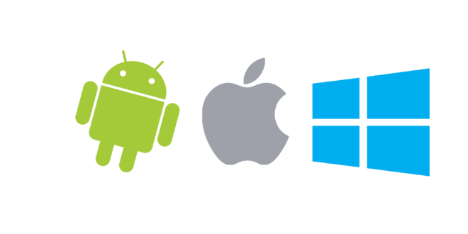
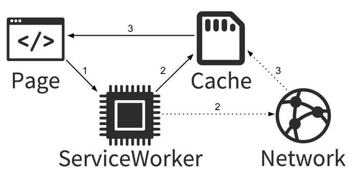
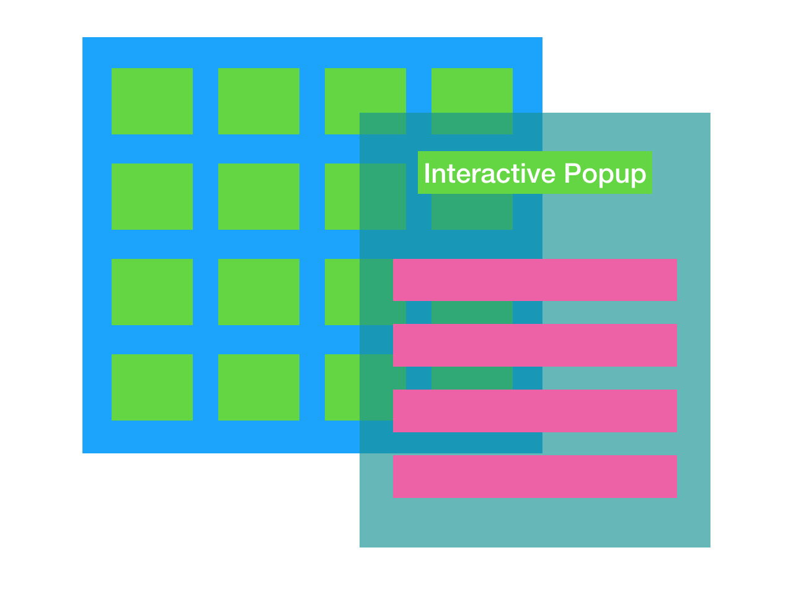
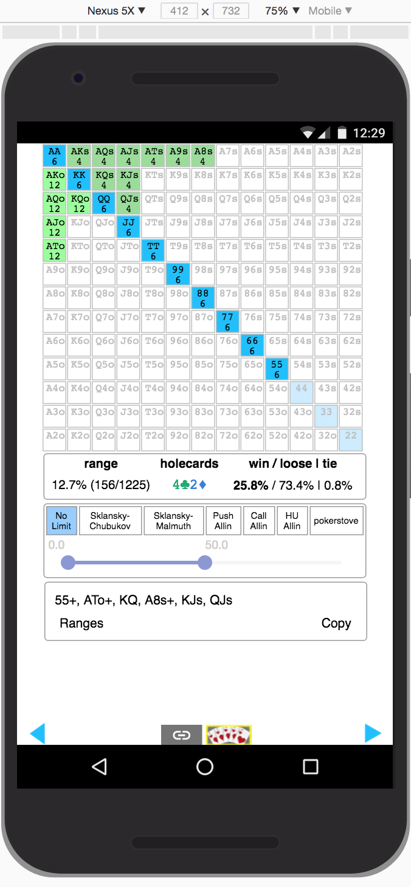
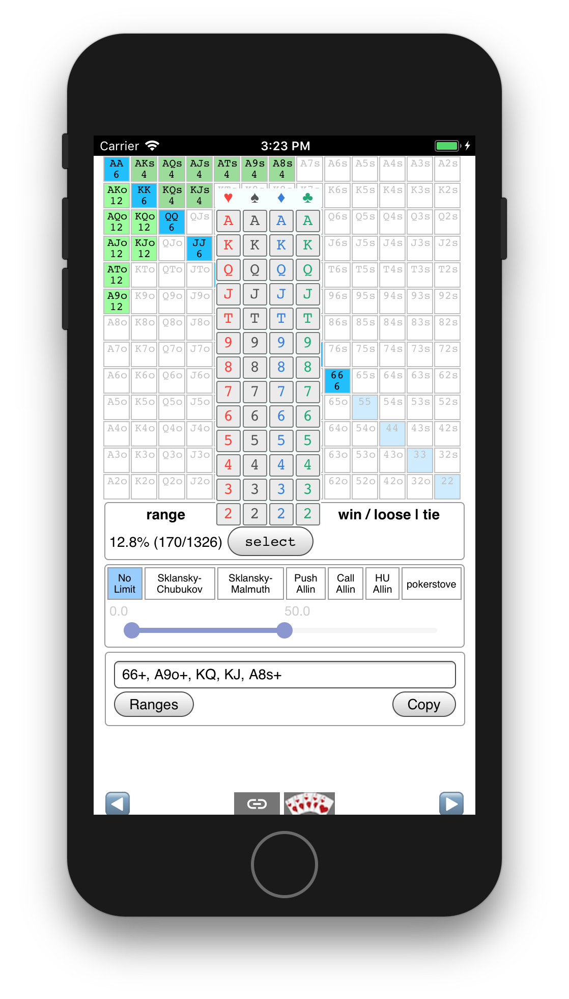
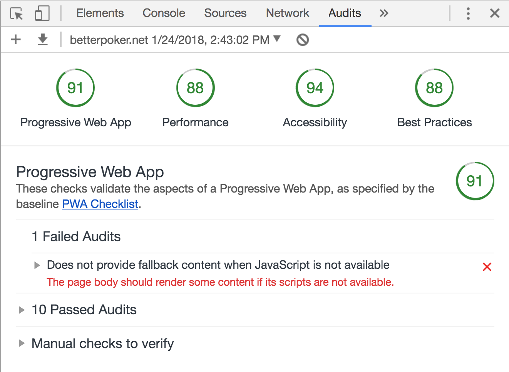

# Progressive Webapps


<div style="text-align: center;">
  
</div>

<p style="text-align: center;">
  <small><a href="http://thlorenz.com">Thorsten Lorenz</a></small>
</p>
<p style="text-align: center;">
  <a href="https://nodesource.com/">
    <svg width="60px" viewBox="0 0 97.34 97.34"><path d="M48.67,3.89A44.78,44.78,0,1,1,3.89,48.67,44.83,44.83,0,0,1,48.67,3.89m0-3.89A48.67,48.67,0,1,0,97.34,48.67,48.73,48.73,0,0,0,48.67,0Z"></path><path d="M49.81,71a1.14,1.14,0,1,1-2.28,0V26.34a1.14,1.14,0,1,1,2.28,0Z"></path><path d="M33.61,60.93A2,2,0,0,1,32,60.15l-12.22-16V59a2,2,0,0,1-3.94,0V38.39a2,2,0,0,1,3.53-1.2l12.22,16V38.39a2,2,0,0,1,3.94,0V59a2,2,0,0,1-2,2Z"></path><path d="M77.6,41.8l-.52-.31a15,15,0,0,0-1.39-.69,11.2,11.2,0,0,0-2.24-.71,10.08,10.08,0,0,0-3-.12,6.05,6.05,0,0,0-3,1,2.66,2.66,0,0,0-.85,1,2.47,2.47,0,0,0-.18.63V43s0-.2,0-.09v0a5.48,5.48,0,0,0,0,.55A2,2,0,0,0,67,44.53a4.81,4.81,0,0,0,1.52,1,13.64,13.64,0,0,0,2.19.7c.39.1.8.18,1.2.26s.85.16,1.37.29a14.23,14.23,0,0,1,5.62,2.49A6.69,6.69,0,0,1,81,52.19a6,6,0,0,1,.33,1.87v.66l0,.15,0,.16a5.29,5.29,0,0,1-.15.76,7.12,7.12,0,0,1-4.41,4.67,13.34,13.34,0,0,1-5,.91,11,11,0,0,1-1.14-.07c-.43,0-.78-.11-1.14-.17a14.27,14.27,0,0,1-1.92-.54,16.35,16.35,0,0,1-2.84-1.37,14.56,14.56,0,0,1-2.22-1.63l-.08-.08a1.77,1.77,0,0,1,2.34-2.65A12,12,0,0,0,66.58,56a13.43,13.43,0,0,0,2.25,1,10.4,10.4,0,0,0,1.4.36c.24,0,.51.08.71.09s.65,0,.81,0a9.48,9.48,0,0,0,3.46-.61,3.34,3.34,0,0,0,2.08-1.93,2.21,2.21,0,0,0-.91-2.57,10.59,10.59,0,0,0-4-1.71c-.34-.09-.88-.19-1.23-.26s-.93-.18-1.4-.3a17.46,17.46,0,0,1-2.83-.92,8.63,8.63,0,0,1-2.79-1.86,5.89,5.89,0,0,1-1.62-3.43c0-.34,0-.45-.05-.69V42.6c0-.15,0-.29,0-.44a6.41,6.41,0,0,1,.47-1.7A6.6,6.6,0,0,1,65,37.88,9.87,9.87,0,0,1,70,36a12.79,12.79,0,0,1,7.25,1.36A13.58,13.58,0,0,1,79,38.47l.54.4a1.77,1.77,0,0,1-2,3Z"></path><path d="M90.29,0a7.06,7.06,0,1,0,7.06,7.06A7.06,7.06,0,0,0,90.29,0Zm0,12.87A5.81,5.81,0,1,1,96.1,7.06,5.82,5.82,0,0,1,90.29,12.87Z"></path><path d="M88.58,10.24A.61.61,0,0,1,88,9.63V4.48a.61.61,0,0,1,.61-.61H91a1.89,1.89,0,1,1,0,3.78H89.19v2A.61.61,0,0,1,88.58,10.24Zm.61-3.81H91c.49,0,.81-.26.81-.67s-.32-.67-.81-.67H89.19Z"></path><path d="M92.41,10.24a.61.61,0,0,1-.5-.26L90.1,7.41a.61.61,0,0,1,1-.7l1.82,2.57a.61.61,0,0,1-.5,1Z"></path></svg>
  </a>
</p>
<p style="text-align: center;">
  <small>twitter <a href="http://twitter.com/thlorenz">@thlorenz</a>  |  github  <a href="http://github/thlorenz">@thlorenz</a>
</p>

# What Are Progressive Webapps?

Applications built using Web technologies that maybe used on mobile devices and the Desktop
inside the browser or as standalone applications.

# Can Be a Game Changer

> maybe used on mobile devices and the Desktop

# Can Be a Game Changer

<blockquote>
  <p style="font-size: 30px"><em>maybe used on mobile devices and the Desktop</em></p>
</blockquote>

# Can Be a Game Changer

<blockquote>
  <p style="font-size: 35px"><em>maybe used on mobile devices and the Desktop</em></p>
</blockquote>

# Can Be a Game Changer

<blockquote>
  <p style="font-size: 38px"><em>maybe used on mobile devices and the Desktop</em></p>
</blockquote>

# Can Be a Game Changer

<blockquote>
  <p style="font-size: 38px"><em>maybe used on mobile devices and the Desktop</em></p>
</blockquote>

- is _build once run everywhere_ finally not a lie?

# Can Be a Game Changer

<p style="text-align: center; font-size: 78px;">
🤔
</p>

# Can Be a Game Changer

<p style="text-align: center; font-size: 78px;">
🤔
</p>

- I had to find out

# The App I Built

- let's learn about Poker first
- then we'll look at _ranginator_, the app that helps you learn how to read your opponent's
  hands


# Progressive Webapps Are

### Progressive

- Work for every user, regardless of browser choice because they’re built with progressive
  enhancement as a core tenet


# Progressive Webapps Are

### Responsive

- Fit any form factor: desktop, mobile, tablet, or forms yet to emerge


# Progressive Webapps Are

### Connectivity independent

- work offline on low quality networks as well as with good connectivity


# Progressive Webapps Are

### App-like

- Feel like an app to the user with app-style interactions and navigation.



# Progressive Webapps Are

### Fresh

- Always up-to-date


# Progressive Webapps Are

### Safe

- Prevent snooping and ensure content hasn’t been tampered with.


# Progressive Webapps Are

### Installable

- Allow users to _keep_ apps they find most useful on their home screen without the hassle of
  an app store


# Progressive Webapps Are

### Discoverable

- identifiable as _applications_


# Progressive Webapps Are

### Re-engageable

- Make re-engagement easy through features like push notifications.


# Progressive Webapps Are

### Linkable

- Easily shared via a URL and do not require complex installation
- [sample ranginator link including config](http://localhost:3333/ranginator/?share=0G00ofkWiDjgX5L8m5v98D8*******,000aB2G0Mm241401JBAa2WkWiDj0000w0001s0002U0003k08Y43184Ka36e2m*0a0K1e0K502*2a0U1e0U*392e0K1a0K*392e0e1a0e*9HIACB*z)


# Progressive Webapp Enablers

### Service Worker

> Service worker is a programmable network proxy, allowing you to control how network requests
> from your page are handled



- can cache the **entire page/app** for offline use


# Progressive Webapp Enablers

### Service Worker

- supports features aside caching like _automatic updates_, _background sync_ and _push
  notifications_
- at this point not supported in Safari, but coming soon

# Progressive Webapp Enablers

### Service Worker

- setup via [workbox](https://developers.google.com/web/tools/workbox/) or similar tools
- make sure to your filenames contain _content hashes_ to invalidate cache properly, aka
  [cache busting](https://www.alainschlesser.com/bust-cache-content-hash/)
- writing service worker files by hand is possible but won't scale

# Progressive Webapp Enablers

### web manifest

> provides information about an application (such as name, author, icon, and description) in a
> JSON text file.

> The purpose of the manifest is to install web applications to the homescreen
> of a device, providing users with quicker access and a richer experience.

- [mdn resource](https://developer.mozilla.org/en-US/docs/Web/Manifest)

# Progressive Webapp Enablers

### web manifest

```js
{
  "name": "MyApp",
  "short_name": "MyApp",
  "start_url": ".",
  "display": "standalone",
  "background_color": "#fff",
  "description": "A super duper app.",
  "icons": [{
    "src": "images/touch/homescreen48.png",
    "sizes": "48x48",
    "type": "image/png"
  },
  // ...
  ],
  "related_applications": [{
    "platform": "play",
    "url": "https://play.google.com/store/apps/details?id=me.myap"
  }]
}
```

# Progressive Webapp Enablers

### web manifest

- must have for smooth _add to home screen_ experience
- include as follows

```html
<link rel="manifest" href="/manifest.json">
<meta name="mobile-web-app-capable" content="yes">
<meta name="apple-mobile-web-app-capable" content="yes">
```

# Progressive Webapp Enablers

### https

> HTTPS (HTTP Secure) is an adaptation of the Hypertext Transfer Protocol (HTTP) for secure
> communication over a computer network

- requirement for a _proper progressive web app_
- no excuse to not use it since it became easy to obtain and renew certificates with
  [let's encrypt](https://letsencrypt.org/)

# Progressive Webapp Enablers

### Responsiveness

- CSS media queries make simple layout fairly easy

```css
/* sticky nav footer for mobile (including iPad) */
@media only screen and (max-width: 750px) and (max-height: 812px) {
  /* ... */
}
```

# Progressive Webapp Enablers

### Responsiveness

- may even target specific standard devices via exact [_media
  queries_](https://css-tricks.com/snippets/css/media-queries-for-standard-devices/)

```css

/* ----------- Google Pixel ----------- */

/* Portrait */
@media screen
  and (device-width: 360px)
  and (device-height: 640px)
  and (-webkit-device-pixel-ratio: 3)
  and (orientation: portrait) {

}

/* Landscape */
@media screen
  and (device-width: 360px)
  and (device-height: 640px)
  and (-webkit-device-pixel-ratio: 3)
  and (orientation: landscape) {

}
```

# Progressive Webapp Enablers

### Responsiveness

- some arrangements don't make sense for devices, use popup vs. sidebar
- need to have different render paths depending on window size
- with React simple to adjust after resizes by changing _state_ and forcing re-render

# So Far We Learned

- setting up a proper PWA is a lot of work but fairly straight forward
  - scafolders to do this for you like
    [create-react-app](https://github.com/facebook/create-react-app) exist as well,
    [see](https://github.com/facebook/create-react-app/pull/1728)
- optimizing how your app renders for each device is trivial in some cases when only CSS
  adjustments are needed and even very custom tweaks achievable via JavaScript

# Cross Device Functionality

- how about making your app _function_ well on all devices?


# Cross Device Interactions Are Easy

- touch events fire mouse events which fire click events, voilà


# Cross Device Interactions Are Hard

### Click vs. Touch vs. Mouse



# Cross Device Interactions Are Hard

### Click vs. Touch vs. Mouse

- what does `preventDefault` of _touch start_ do to _click_?

# Cross Device Interactions Are Hard

### Click vs. Touch vs. Mouse and Browser Functionality

- what does `preventDefault` of _touch start_ do to _scrolling_?

# Cross Device Interactions Are Hard

### Click vs. Touch vs. Mouse and Browser Functionality

- what does `preventDefault` of _touch start_ do to _scrolling_?
- how do I know the user wanted to scroll, or _tap_, or  _touch press_?

# Cross Device Interactions Are Hard


# Cross Device Interactions Are Hard

### ios clicks != android clicks

- android _touch press_ fires _contextMenu_
- ios _touch press_ fires ...
# Cross Device Interactions Are Hard

### ios clicks != android clicks

- android _touch press_ fires _contextMenu_
- ios _touch press_ fires ... NOTHING

# Cross Device Interactions Are Hard

### ios clicks != android clicks

- android _touch press_ fires _contextMenu_
- ios _touch press_ fires ... NOTHING

<p style="text-align: center; font-size: 78px;">
🙃
</p>

# Cross Device Interactions Are Hard

### ios clicks != android clicks

- android _double tap_ fires _double click_
- ios _double tap_ fires ...

# Cross Device Interactions Are Hard

### ios clicks != android clicks

- android _double tap_ fires _double click_
- ios _double tap_ fires ... NOTHING

# Cross Device Interactions Are Hard

### ios clicks != android clicks

- android _double tap_ fires _double click_
- ios _double tap_ fires ... NOTHING

<p style="text-align: center; font-size: 78px;">
🤪
</p>

# Cross Device Interactions Are Hard


# Cross Device Interactions Are Hard

### ios clicks != android clicks

- can't rely on _double tap_ or _touch press_

# Cross Device Interactions Are Hard

### Solutions

<iframe src="http://hammerjs.github.io/" width="100%" height="500px"></iframe>

# Cross Device Interactions Are Hard

### Solutions

<iframe src="http://docs.sencha.com/touch/index.html" width="100%" height="500px"></iframe>

# Cross Device Interactions Are Hard

### Solutions

- many others exist, sometimes focusing on just one type of gesture, i.e. swipe
- work for generic scenarios, but once interactions get complex you need a custom solution for
  your particular scenario

# Implementing Interactions

### Separate Mouse and Touch Events

- start directly in your component, pull out commonalities later
- add a way to debug interactions via log statements you can turn on and off

# Clickable

```js
_onmouseDown(e) {
  if (istouch(this)) return
  this._debugInteractions('mouse-down', e)
  this._clickPotential = true
}

_onmouseMove(e) {
  if (istouch(this)) return
  this._debugInteractions('mouse-move', e)
  this._clickPotential = false
}

_onmouseUp(e) {
  if (istouch(this)) return
  this._debugInteractions('mouse-up', e)
  if (!this._clickPotential) return
  this._clickPotential = false

  this._onclick(e)
}
```

# Clickable

```js
_ontouchStart(e) {
  touch(this)
  this._debugInteractions('touch-start', e)

  const pos = getTouchPosition(e)
  this._detailDebugInteractions('touch-start', pos)

  this._tapPotential = true
  this._tapStartPos = pos

  if (this._hasRightClick) {
    this._clearPressPotential()
    this._pressTimeout = setTimeout(this._ontouchPress, this._pressMs)
    this._pressEvent = e
  }
}
```

# Clickable

```js
_ontouchMove(e) {
  touch(this)
  this._debugInteractions('touch-move', e)
  const pos = getTouchPosition(e)

  if (!this._tapPotential || pos == null || this._tapStartPos == null) {
    this._tapPotential = false
    this._clearPressPotential()
  } else {
    const { dx, dy } = getPositionDelta(pos, this._tapStartPos)
    this._detailDebugInteractions('touch-move', { dx, dy })

    const smallEnoughMove = dx < this._tapDistance && dy < this._tapDistance
    if (!smallEnoughMove) {
      this._tapPotential = false
      this._clearPressPotential()
    }
  }
}
```

# Clickable

```js
_ontouchEnd(e) {
  touch(this)
  this._debugInteractions('touch-end', e)
  this._clearPressPotential()

  if (!this._tapPotential) return
  this._tapPotential = false
  this._onclick(e)
}

_ontouchPress() {
  if (this._pressTimeout == null) return
  const e = this._pressEvent

  this._debugInteractions('touch-press', e)

  this._clearPressPotential()
  this._tapPotential = false
  this._onrightClick(e)
}
```
# Testing Interactions

- DevTools helps but not accurate for interactions
- highly usable to test reponsiveness



# Testing Interactions

- OSX iPhone emulator very accurate to test interactions



# Testing Interactions

- should always test physical device before release
- android devices behave similarly
- iPad and iPhone behave similarly

# Scoring Your PWA with Lighthouse


# Scoring Your PWA with Lighthouse



# Resources

- [awesmoe list of PWA](https://github.com/hemanth/awesome-pwa)

<iframe width="450" height="250" src="https://www.youtube.com/embed/videoseries?list=PL4k64WemroGmL5XHmaFGnP0mbhf4vy2xs" frameborder="0" allow="autoplay; encrypted-media" allowfullscreen></iframe>

_[my personal playlist related to PWA](https://www.youtube.com/playlist?list=PL4k64WemroGmL5XHmaFGnP0mbhf4vy2xs)_

# Thanks 🙏

## Interested in Programming?

- follow [@thlorenz](https://twitter.com/thlorenz) on twitter
- follow [twitch.tv/thlorenz](https://www.twitch.tv/thlorenz), my Twitch channel where I 📺 cool open source

## Interested in betterpoker.net?

- follow [@betterpoker_net](https://twitter.com/betterpoker_net) on twitter
- follow the [betterpoker.net facebook page](https://www.facebook.com/betterpoker.net)
- follow [twitch.tv/betterpoker_net](https://www.twitch.tv/betterpoker_net), the Twitch channel
  where I 📺 Poker strategy related content and how to use the ranginator
- check [betterpoker.net](https://betterpoker.net/) where I will release the the new
  [ranginator](https://betterpoker.net/ranginator) very soon
