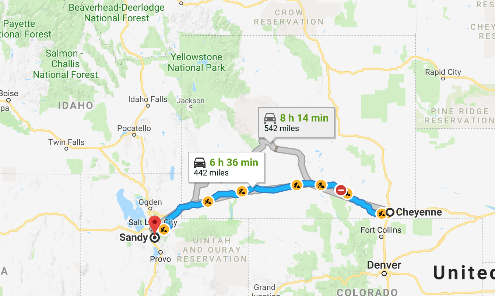
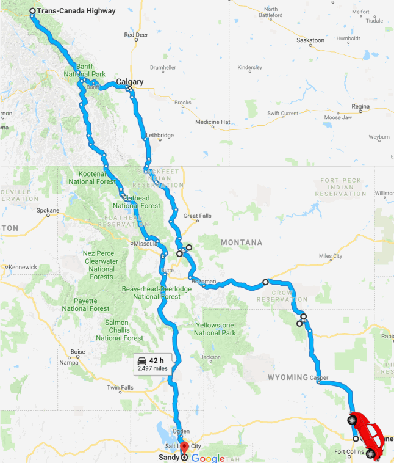
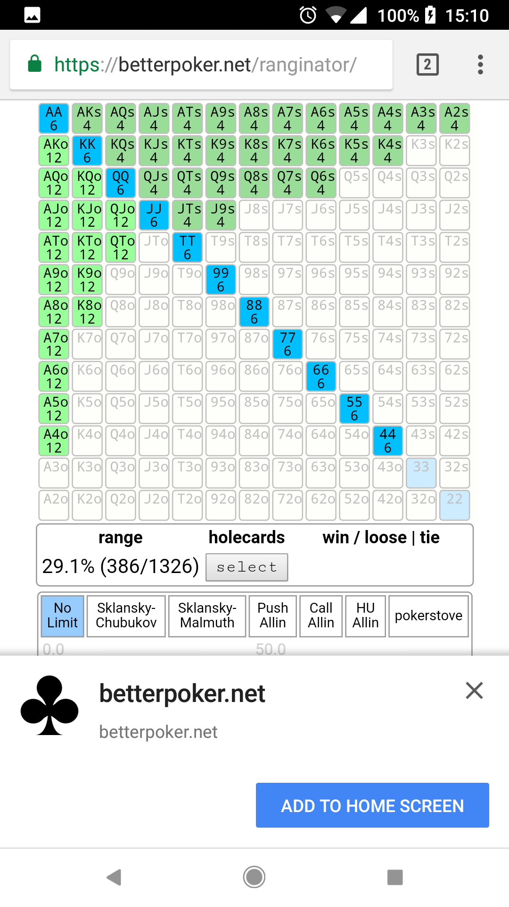

# Progressive Webapps


<div style="text-align: center;">
  
</div>

<p style="text-align: center;">
  <small><a href="http://thlorenz.com">Thorsten Lorenz</a></small>
</p>
<p style="text-align: center;">
  <small>twitter <a href="http://twitter.com/thlorenz">@thlorenz</a>  |  github  <a href="http://github/thlorenz">@thlorenz</a>
</p>

# Progressive Journey



# Progressive Journey



# Progressive Journey


# Progressive Journey


# Progressive Journey


# What Are Progressive Webapps?

Applications built using Web technologies that maybe used on mobile devices and the Desktop
inside the browser or as standalone applications.

# Can Be a Game Changer

> maybe used on mobile devices and the Desktop

# Can Be a Game Changer

<blockquote>
  <p style="font-size: 24px"><em>maybe used on mobile devices and the Desktop</em></p>
</blockquote>

# Can Be a Game Changer

<blockquote>
  <p style="font-size: 30px"><em>maybe used on mobile devices and the Desktop</em></p>
</blockquote>

# Can Be a Game Changer

<blockquote>
  <p style="font-size: 38px"><em>maybe used on mobile devices and the Desktop</em></p>
</blockquote>

# Can Be a Game Changer

<p style="text-align: center; font-size: 78px;">
🤔
</p>

# Can Be a Game Changer

<p style="text-align: center; font-size: 78px;">
🤔
</p>

> is _build once run everywhere_ finally not a lie?

# Can Be a Game Changer

<p style="text-align: center; font-size: 78px;">
🤔
</p>

> I had to find out

# The App I Built

- let's learn about Poker first
- then we'll look at _ranginator_, the app that helps you learn how to read your opponent's
  hands


# The App I Built

- let's look at a Poker hand

```
PokerStars Hand #164138426262: Tournament #1776003808, $5.00+$0.50 USD Hold'em No Limit - Level III (50/100) - 2017/01/06 13:41:27 ET
Table '1776003808 21' 9-max Seat #4 is the button
Seat 1: mondaycoffe (9876 in chips)
Seat 2: JaguarCanna (5597 in chips)
Seat 3: Johnnie Guti (8904 in chips)
Seat 4: twadski88 (9200 in chips) is sitting out
Seat 5: JayJay14687 (4779 in chips)
Seat 6: hero (10071 in chips)
Seat 7: happyjack (9692 in chips)
Seat 8: datrue (11564 in chips)
Seat 9: parcerito22 (18514 in chips)
mondaycoffe: posts the ante 12
JaguarCanna: posts the ante 12
Johnnie Guti: posts the ante 12
twadski88: posts the ante 12
JayJay14687: posts the ante 12
hero: posts the ante 12
happyjack: posts the ante 12
datrue: posts the ante 12
parcerito22: posts the ante 12
JayJay14687: posts small blind 50
hero: posts big blind 100
*** HOLE CARDS ***
Dealt to hero [Kc Th]
happyjack: folds
datrue: raises 150 to 250
parcerito22: folds
mondaycoffe: folds
JaguarCanna: folds
Johnnie Guti: folds
twadski88: folds
JayJay14687: folds
hero: calls 150
*** FLOP *** [8c 6c Kh]
hero: checks
datrue: bets 270
twadski88 is disconnected
hero: calls 270
*** TURN *** [8c 6c Kh] [8h]
hero: checks
datrue: checks
*** RIVER *** [8c 6c Kh 8h] [4c]
hero: checks
datrue: bets 491
hero: calls 491
*** SHOW DOWN ***
datrue: shows [Ks Ah] (two pair, Kings and Eights)
hero: mucks hand
datrue collected 2180 from pot
*** SUMMARY ***
Total pot 2180 | Rake 0
Board [8c 6c Kh 8h 4c]
Seat 1: mondaycoffe folded before Flop (didn't bet)
Seat 2: JaguarCanna folded before Flop (didn't bet)
Seat 3: Johnnie Guti folded before Flop (didn't bet)
Seat 4: twadski88 (button) folded before Flop (didn't bet)
Seat 5: JayJay14687 (small blind) folded before Flop
Seat 6: hero (big blind) mucked [Th Kc]
Seat 7: happyjack folded before Flop (didn't bet)
Seat 8: datrue showed [Ks Ah] and won (2180) with two pair, Kings and Eights
Seat 9: parcerito22 folded before Flop (didn't bet)
```

# Progressive Webapps Are

### Progressive

- Work for every user, regardless of browser choice because they’re built with progressive
  enhancement as a core tenet


# Progressive Webapps Are

### Responsive

- Fit any form factor: desktop, mobile, tablet, or forms yet to emerge


# Progressive Webapps Are

### Connectivity independent

- work offline, on low quality networks, as well as with good connectivity


# Progressive Webapps Are

### App-like

- Feel like an app to the user with app-style interactions and navigation.


# Progressive Webapps Are

### Fresh

- Always up-to-date


# Progressive Webapps Are

### Safe

- Prevent snooping and ensure content hasn’t been tampered with.


# Progressive Webapps Are

### Installable

- Allow users to _keep_ apps they find most useful on their home screen without the hassle of
  an app store


# Progressive Webapps Are

### Installable



# Progressive Webapps Are

### Discoverable

- identifiable as _applications_


# Progressive Webapps Are

### Re-engageable

- Make re-engagement easy through features like push notifications.


# Progressive Webapps Are

### Linkable

- Easily shared via a URL and do not require complex installation
- [sample ranginator link including config](https://betterpoker.net/ranginator/?share=0G00ofkWiDjgX5L8m5v98D8*******,000aB2G0Mm241401JBAa2WkWiDj0000w0001s0002U0003k08Y43184Ka36e2m*0a0K1e0K502*2a0U1e0U*392e0K1a0K*392e0e1a0e*9HIACB*z)


# Progressive Webapp Enablers

### Service Worker

> Service worker is a programmable network proxy, allowing you to control how network requests
> from your page are handled


- can cache the **entire page/app** for offline use

# Progressive Webapp Enablers

### Service Worker

- supports features aside caching like _automatic updates_, _background sync_ and _push
  notifications_
- at this point ~~not~~ supported in Safari, ~~but coming soon~~

# Progressive Webapp Enablers

### Service Worker

- setup via [workbox](https://developers.google.com/web/tools/workbox/) or similar tools
- make sure that your filenames contain _content hashes_ to invalidate cache properly, aka
  [cache busting](https://www.alainschlesser.com/bust-cache-content-hash/)
- writing service worker files by hand is possible but won't scale

# Progressive Webapp Enablers

### Service Worker Stragegies


_Stale-While-Revalidate_

# Progressive Webapp Enablers

### Service Worker Stragegies


_Cache First_

# Progressive Webapp Enablers

### Service Worker Stragegies


_Network First_

# Progressive Webapp Enablers

### Service Worker Stragegies


_Network Only_

# Progressive Webapp Enablers

### Service Worker Stragegies


_Cache Only_

# Progressive Webapp Enablers

### web manifest

> provides information about an application (such as name, author, icon, and description) in a
> JSON text file.

> The purpose of the manifest is to install web applications to the homescreen
> of a device, providing users with quicker access and a richer experience.

- [mdn resource](https://developer.mozilla.org/en-US/docs/Web/Manifest)

# Progressive Webapp Enablers

### web manifest

```js
{
  "name": "MyApp",
  "short_name": "MyApp",
  "start_url": ".",
  "display": "standalone",
  "background_color": "#fff",
  "description": "A super duper app.",
  "icons": [{
    "src": "images/touch/homescreen48.png",
    "sizes": "48x48",
    "type": "image/png"
  },
  // ...
  ],
  "related_applications": [{
    "platform": "play",
    "url": "https://play.google.com/store/apps/details?id=me.myap"
  }]
}
```

# Progressive Webapp Enablers

### web manifest

- must have for smooth _add to home screen_ experience
- include as follows

```html
<link rel="manifest" href="/manifest.json">
<meta name="mobile-web-app-capable" content="yes">
<meta name="apple-mobile-web-app-capable" content="yes">
```

# Progressive Webapp Enablers

### https

> HTTPS (HTTP Secure) is an adaptation of the Hypertext Transfer Protocol (HTTP) for secure
> communication over a computer network

- requirement for a _proper progressive web app_
- no excuse to not use it since it became easy to obtain and renew certificates with
  [let's encrypt](https://letsencrypt.org/)

# Progressive Webapp Enablers

### Responsiveness

- CSS media queries make simple layout fairly easy

```css
/* sticky nav footer for mobile (including iPad) */
@media only screen and (max-width: 750px) and (max-height: 812px) {
  /* ... */
}
```

# Progressive Webapp Enablers

### Responsiveness

- may even target specific standard devices via exact [_media
  queries_](https://css-tricks.com/snippets/css/media-queries-for-standard-devices/)

```css

/* ----------- Google Pixel ----------- */

/* Portrait */
@media screen
  and (device-width: 360px)
  and (device-height: 640px)
  and (-webkit-device-pixel-ratio: 3)
  and (orientation: portrait) {

}

/* Landscape */
@media screen
  and (device-width: 360px)
  and (device-height: 640px)
  and (-webkit-device-pixel-ratio: 3)
  and (orientation: landscape) {

}
```

# Progressive Webapp Enablers

### Responsiveness

- some arrangements don't make sense for devices, use popup vs. sidebar
- need to have different render paths depending on window size
- with React simple to adjust after resizes by changing _state_ and forcing re-render

# So Far We Learned

- setting up a proper PWA is a lot of work but fairly straight forward
  - scafolders to do this for you like
    [create-react-app](https://github.com/facebook/create-react-app) exist as well,
    [see this PR](https://github.com/facebook/create-react-app/pull/1728)
- optimizing how your app renders for each device is trivial in some cases when only CSS
  adjustments are needed and very custom tweaks achievable via JavaScript

# Cross Device Functionality

- how about making your app _function_ well on all devices?


# Cross Device Interactions Are Easy

- touch events fire mouse events which fire click events, voilà


# Cross Device Interactions Are Hard

### Click vs. Touch vs. Mouse


# Cross Device Interactions Are Hard

### Click vs. Touch vs. Mouse

- what does `preventDefault` of _touch start_ do to _click_?

# Cross Device Interactions Are Hard

### Click vs. Touch vs. Mouse and Browser Functionality

- what does `preventDefault` of _touch start_ do to _scrolling_?

# Cross Device Interactions Are Hard

### Click vs. Touch vs. Mouse and Browser Functionality

- what does `preventDefault` of _touch start_ do to _scrolling_?
- how do I know the user wanted to scroll, or _tap_, or  _touch press_?

# Cross Device Interactions Are Hard


# Cross Device Interactions Are Hard

### ios clicks != android clicks

- android _touch press_ fires _contextMenu_
- ios _touch press_ fires ...
# Cross Device Interactions Are Hard

### ios clicks != android clicks

- android _touch press_ fires _contextMenu_
- ios _touch press_ fires ... NOTHING

# Cross Device Interactions Are Hard

### ios clicks != android clicks

- android _touch press_ fires _contextMenu_
- ios _touch press_ fires ... NOTHING

<p style="text-align: center; font-size: 78px;">
🙃
</p>

# Cross Device Interactions Are Hard

### ios clicks != android clicks

- android _double tap_ fires _double click_
- ios _double tap_ fires ...

# Cross Device Interactions Are Hard

### ios clicks != android clicks

- android _double tap_ fires _double click_
- ios _double tap_ fires ... NOTHING

# Cross Device Interactions Are Hard

### ios clicks != android clicks

- android _double tap_ fires _double click_
- ios _double tap_ fires ... NOTHING

<p style="text-align: center; font-size: 78px;">
🤪
</p>

# Cross Device Interactions Are Hard


# Cross Device Interactions Are Hard

### ios clicks != android clicks

- can't rely on _double tap_ or _touch press_ to trigger related _mouse_ events

# Cross Device Interactions Are Hard

### Solutions

<iframe src="http://hammerjs.github.io/" width="100%" height="500px"></iframe>

# Cross Device Interactions Are Hard

### Solutions

<iframe src="http://docs.sencha.com/touch/index.html" width="100%" height="500px"></iframe>

# Cross Device Interactions Are Hard

### Solutions

- many others exist, sometimes focusing on just one type of gesture, i.e. swipe
- work for generic scenarios, but once interactions get complex you need a custom solution for
  your particular scenario

# Implementing Interactions

### Separate Mouse and Touch Events

- start directly in your component, pull out commonalities later
- add a way to debug interactions via log statements you can turn on and off

# Clickable

```js
_onmouseDown(e) {
  if (istouch(this)) return
  this._debugInteractions('mouse-down', e)
  this._clickPotential = true
}

_onmouseMove(e) {
  if (istouch(this)) return
  this._debugInteractions('mouse-move', e)
  this._clickPotential = false
}

_onmouseUp(e) {
  if (istouch(this)) return
  this._debugInteractions('mouse-up', e)
  if (!this._clickPotential) return
  this._clickPotential = false

  this._onclick(e)
}
```

# Clickable

```js
_ontouchStart(e) {
  touch(this)
  this._debugInteractions('touch-start', e)

  const pos = getTouchPosition(e)
  this._detailDebugInteractions('touch-start', pos)

  this._tapPotential = true
  this._tapStartPos = pos

  if (this._hasRightClick) {
    this._clearPressPotential()
    this._pressTimeout = setTimeout(this._ontouchPress, this._pressMs)
    this._pressEvent = e
  }
}
```

# Clickable

```js
_ontouchMove(e) {
  touch(this)
  this._debugInteractions('touch-move', e)
  const pos = getTouchPosition(e)

  if (!this._tapPotential || pos == null || this._tapStartPos == null) {
    this._tapPotential = false
    this._clearPressPotential()
  } else {
    const { dx, dy } = getPositionDelta(pos, this._tapStartPos)
    this._detailDebugInteractions('touch-move', { dx, dy })

    const smallEnoughMove = dx < this._tapDistance && dy < this._tapDistance
    if (!smallEnoughMove) {
      this._tapPotential = false
      this._clearPressPotential()
    }
  }
}
```

# Clickable

```js
_ontouchEnd(e) {
  touch(this)
  this._debugInteractions('touch-end', e)
  this._clearPressPotential()

  if (!this._tapPotential) return
  this._tapPotential = false
  this._onclick(e)
}

_ontouchPress() {
  if (this._pressTimeout == null) return
  const e = this._pressEvent

  this._debugInteractions('touch-press', e)

  this._clearPressPotential()
  this._tapPotential = false
  this._onrightClick(e)
}
```

# Service Workers Are Tricky

```js
importScripts('https://storage.googleapis.com/workbox-cdn/releases/3.1.0/workbox-sw.js')

workbox.core.setCacheNameDetails({
    prefix          : 'betterpoker.net'
  , suffix          : 'v1'
  , precache        : 'offline'
  , runtime         : 'runtime'
})

workbox.precaching.suppressWarnings()

// `workbox injectManifest` injects manifest here
workbox.precaching.precacheAndRoute([])
```

# Service Workers Are Tricky

### Stop Waiting

- new service worker only activates after all browser tabs with the app are closed

# Service Workers Are Tricky

### Stop Waiting

- new service worker only activates after all browser tabs with the app are closed
- not what I wanted or expected

# Service Workers Are Tricky

### Stop Waiting

# Service Workers Are Tricky

### Stop Waiting

_Please?_

# Service Workers Are Tricky

### Stop Waiting

_Please?_

<p style="text-align: center; font-size: 78px;">
🙏
</p>

# Service Workers Are Tricky

### Stop Waiting

_Pretty Please?_

<p style="text-align: center; font-size: 78px;">
🙏 🙏
</p>

# Service Workers Are Tricky

### Stop Waiting

_Pretty Please?_

<p style="text-align: center; font-size: 78px;">
🙏 🙏 🙏
</p>

# Service Workers Are Tricky

### skipWaiting

> Use this method with `Clients.claim()` to ensure that updates to the underlying service
> worker take effect immediately for both the current client and all other active clients.

[mdn skipWaiting](https://developer.mozilla.org/en-US/docs/Web/API/ServiceWorkerGlobalScope/skipWaiting)

# Service Workers Are Tricky

### skipWaiting

> Use this method with `Clients.claim()` to ensure that updates to the underlying service
> worker take effect immediately for both the current client and all other active clients.

[mdn skipWaiting](https://developer.mozilla.org/en-US/docs/Web/API/ServiceWorkerGlobalScope/skipWaiting)

<p style="text-align: center; font-size: 78px;">
🤨
</p>

# Service Workers Are Tricky

### Clients.Claim

> When a service worker is initially registered, pages won't use it until they next load. The
> `claim()` method causes those pages to be controlled immediately.

[mdn clientsClaim](https://developer.mozilla.org/en-US/docs/Web/API/Clients/claim)

# Service Workers Are Tricky

```js
importScripts('https://storage.googleapis.com/workbox-cdn/releases/3.1.0/workbox-sw.js')

workbox.skipWaiting()
workbox.clientsClaim()

workbox.core.setCacheNameDetails({
    prefix          : 'betterpoker.net'
  , suffix          : 'v1'
  , precache        : 'offline'
  , runtime         : 'runtime'
})

workbox.precaching.suppressWarnings()

// `workbox injectManifest` injects manifest here
workbox.precaching.precacheAndRoute([])
```

# Testing Interactions

- DevTools helps but not accurate for interactions
- highly usable to test reponsiveness


# Testing Interactions

- OSX iPhone emulator very accurate to test interactions


# Testing Interactions

- should always test physical device before release
- android devices behave similarly
- iPad and iPhone behave similarly

# Scoring Your PWA with Lighthouse


# Scoring Your PWA with Lighthouse


# Don't Give Up

- everyone who creates technology will tell you it is great and easy to use

# Don't Give Up

- everyone who creates technology will tell you it is great and easy to use


_¡¡¡Lies!!!_

# Don't Give Up


_It's really more like this_

# Don't Give Up

- don't be discouraged, it happens to ALL OF US
- _google_ the error message
- ask on stack overflow/github
- isolate the problem
- if no success move on to something else and come back later

# Don't Give Up

- take step back, debug closely
- still not working? do you really need this for the first version of your app?

# Getting Started

- [firebase](https://firebase.google.com/) _backend as a service_
  - _spark plan_ is free
  - risk of lock-in
- use if time constrained and learning about backend is not desirable

# Resources

- [awesome list of PWA](https://github.com/hemanth/awesome-pwa)
- [firebase](https://www.youtube.com/watch?v=O17OWyx08Cg)

<iframe width="450" height="250" src="https://www.youtube.com/embed/videoseries?list=PL4k64WemroGmL5XHmaFGnP0mbhf4vy2xs" frameborder="0" allow="autoplay; encrypted-media" allowfullscreen></iframe>

_[my personal playlist related to PWA](https://www.youtube.com/playlist?list=PL4k64WemroGmL5XHmaFGnP0mbhf4vy2xs)_

# Thanks 🙏

## Interested in Programming?

- follow [@thlorenz](https://twitter.com/thlorenz) on twitter
- follow [twitch.tv/thlorenz](https://www.twitch.tv/thlorenz), my Twitch channel where I 📺 cool open source

## Interested in betterpoker.net?

- follow [@betterpoker_net](https://twitter.com/betterpoker_net) on twitter
- follow the [betterpoker.net facebook page](https://www.facebook.com/betterpoker.net)
- follow [twitch.tv/betterpoker_net](https://www.twitch.tv/betterpoker_net), the Twitch channel
  where I 📺 Poker strategy related content and how to use the ranginator
- check [betterpoker.net](https://betterpoker.net/) where I will release the the new
  [ranginator](https://betterpoker.net/ranginator) very soon
