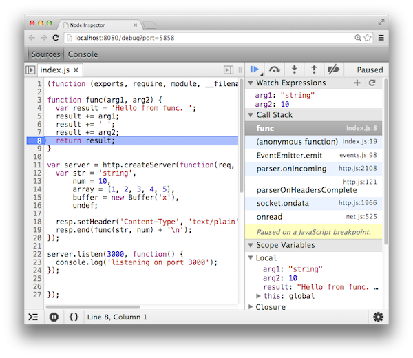
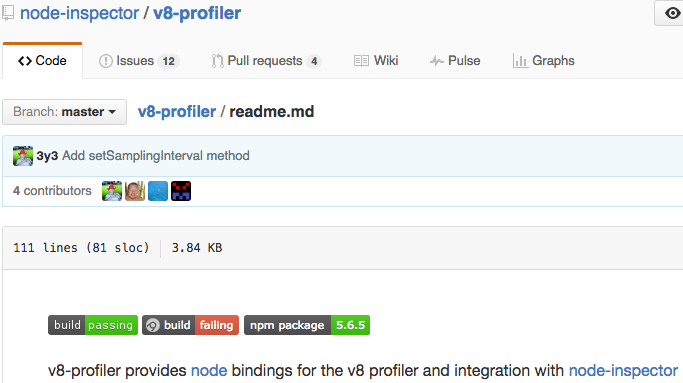
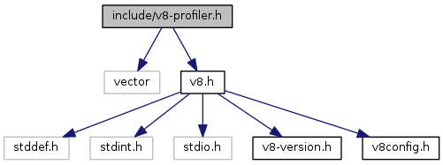
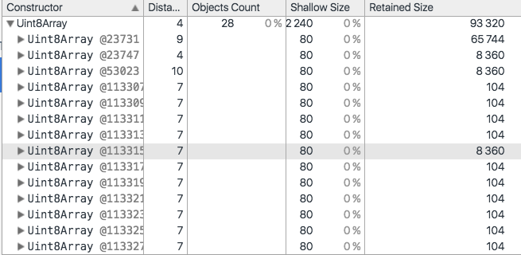
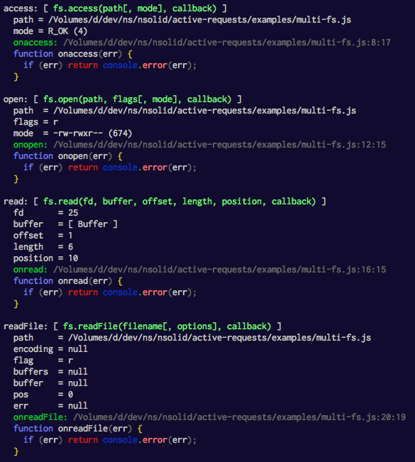

# v8 API Deep Dive

*things you never thought you could do, but can*


# v8 API Deep Dive

<p style="text-align: center;">
  
</p>
<p style="text-align: center;">
  <small><a href="http://thlorenz.com">Thorsten Lorenz</a></small>
</p>
<p style="text-align: center;">
  <small>twitter <a href="http://twitter.com/thlorenz">@thlorenz</a>  |  github  <a href="http://github/thlorenz">@thlorenz</a>  |  irc  thlorenz</small>
</p>

# Let's start from the Top

### node-inspector



# Let's start from the Top

### node-inspector


### v8-profiler 



# Let's start from the Top

|node-inspector |v8-profiler|
|:-:|:---:|
| ||

### v8-api

[](https://v8docs.nodesource.com/node-6.0/df/d0c/v8-profiler_8h.html)

# v8-profiler.h

### Data Structures

```cpp
struct  CpuProfileDeoptFrame
struct  CpuProfileDeoptInfo
class   CpuProfileNode
struct  CpuProfileNode::LineTick
class   CpuProfile
class   CpuProfiler
class   HeapGraphEdge
class   HeapGraphNode
class   OutputStream
class   HeapSnapshot
class   ActivityControl
class   AllocationProfile
struct  AllocationProfile::Allocation
struct  AllocationProfile::Node
class   HeapProfiler
class   HeapProfiler::ObjectNameResolver
class   RetainedObjectInfo
struct  HeapStatsUpdate
```

[Node.js v6 docs page](https://v8docs.nodesource.com/node-6.0/df/d0c/v8-profiler_8h.html)

<!--
CpuProfileNode - show functions
-->

# CpuProfileNode

_v8-profiler_

```cpp
// src/cpu_profile_node.cc

#include "v8-profiler.h"
[ .. ]

using v8::CpuProfileNode;
[ .. ]

Local<Value> ProfileNode::New (const CpuProfileNode* node) {
  Nan::EscapableHandleScope scope;

  int32_t count = node->GetChildrenCount();
  Local<Object> profile_node = Nan::New<Object>();
  Local<Array> children = Nan::New<Array>(count);

  for (int32_t index = 0; index < count; index++) {
    children->Set(index, ProfileNode::New(node->GetChild(index)));
  }

  profile_node->Set(Nan::New<String>("functionName").ToLocalChecked(),
                    node->GetFunctionName());
  profile_node->Set(Nan::New<String>("url").ToLocalChecked(),
                    node->GetScriptResourceName());
  profile_node->Set(Nan::New<String>("lineNumber").ToLocalChecked(),
                    Nan::New<Integer>(node->GetLineNumber()));
  [ .. ]
```

# CpuProfileNode

_v8_

```cpp
// include/v8-profiler.h
class V8_EXPORT CpuProfileNode {
 public:
  [ .. ]

  Local<String> GetFunctionName() const;

  int GetScriptId() const;

  Local<String> GetScriptResourceName() const;

  int GetLineNumber() const;

  int GetColumnNumber() const;

  unsigned int GetHitLineCount() const;

  bool GetLineTicks(LineTick* entries, unsigned int length) const;

  const char* GetBailoutReason() const;
  [ .. ]
};
```

[Node.js v6 source](https://v8docs.nodesource.com/node-6.0/df/d0c/v8-profiler_8h_source.html#l00052)

# CpuProfileNode::GetLineTicks

_v8_

```cpp
// src/v8/api.cc
bool CpuProfileNode::GetLineTicks(LineTick* entries,
                                  unsigned int length) const {
  const i::ProfileNode* node = reinterpret_cast<const i::ProfileNode*>(this);
  return node->GetLineTicks(entries, length);
}
```

[source in chromium code search](https://code.google.com/p/chromium/codesearch#chromium/src/v8/src/api.cc&sq=package:chromium&type=cs&q=GetLineTicks&l=8204)

# ProfileNode::GetLineTicks

_v8_

```cpp
// src/profiler/profile-generator.h
bool GetLineTicks(v8::CpuProfileNode::LineTick* entries,
                  unsigned int length) const;
```

[source in chromium code search](https://code.google.com/p/chromium/codesearch#chromium/src/v8/src/profiler/profile-generator.h&sq=package:chromium&type=cs&l=159&rcl=1464189471)

# ProfileNode::GetLineTicks

_v8_

```cpp
// src/profiler/profile-generator.cc
bool ProfileNode::GetLineTicks(v8::CpuProfileNode::LineTick* entries,
                               unsigned int length) const {
  if (entries == NULL || length == 0) return false;

  unsigned line_count = line_ticks_.occupancy();

  if (line_count == 0) return true;
  if (length < line_count) return false;

  v8::CpuProfileNode::LineTick* entry = entries;

  for (HashMap::Entry* p = line_ticks_.Start(); p != NULL;
       p = line_ticks_.Next(p), entry++) {
    entry->line =
        static_cast<unsigned int>(reinterpret_cast<uintptr_t>(p->key));
    entry->hit_count =
        static_cast<unsigned int>(reinterpret_cast<uintptr_t>(p->value));
  }

  return true;
}
```

[source in chromium code search](https://code.google.com/p/chromium/codesearch#chromium/src/v8/src/profiler/profile-generator.cc&sq=package:chromium&type=cs&l=204&rcl=1464189471)

# ProfileNode::GetLineTicks

Learn how things work by looking at and running tests.

```cpp
// test/cctest/test-cpu-profiler.cc
  [..]
  unsigned int line_count = func_node->GetHitLineCount();
  CHECK_EQ(2u, line_count);  // Expect two hit source lines - #1 and #5.
  ScopedVector<v8::CpuProfileNode::LineTick> entries(line_count);
  CHECK(func_node->GetLineTicks(&entries[0], line_count));
  int value = 0;
  for (int i = 0; i < entries.length(); i++)
    if (entries[i].line == hit_line) {
      value = entries[i].hit_count;
      break;
    }
  CHECK_EQ(hit_count, value);
```

[source in chromium code search](https://code.google.com/p/chromium/codesearch#chromium/src/v8/test/cctest/test-cpu-profiler.cc&sq=package:chromium&type=cs&q=GetLineTicks&l=1070)

# Getting v8

```
git clone https://chromium.googlesource.com/chromium/tools/depot_tools.git
export PATH=`pwd`/depot_tools:"$PATH"
fetch v8
```

[instructions](https://github.com/v8/v8/wiki/Using%20Git)

# Generating v8 Xcode Project

```
gypfiles/gyp_v8 -Dtarget_arch=x64

## Open in Xcode
open gypfiles/all.xcodeproj

## Or build with Xcode on Commandline
xcodebuild -project gypfiles/all.xcodeproj
```

[instructions](https://github.com/v8/v8/wiki/Building-with-Gyp#xcode)


# Running Tests

- select `cctest` project
- show all tests via `cctest` project and passing `--list` as an argument

```
codegen-tester/CompareWrapper
codegen-tester/ParametersEqual
codegen-tester/RunEmpty
[..]
codegen-tester/RunBinopTester
codegen-tester/RunBufferedRawMachineAssemblerTesterTester
test-basic-block-profiler/ProfileDiamond
test-basic-block-profiler/ProfileLoop
[..]
```

# Running Specific Test

- run `cctest` with the test name as argument, i.e. `test-cpu-profiler/TickLinesBaseline`
- happy debugging :)


# External Buffer Memory Example

_One of the things we can do that we didn't think we could_

# External Buffer Memory Example

_We don't know what's in here_



# External Buffer Memory Example

- what if we could find all buffers in a snapshot and get a hold of them?
- OH MY!!! then we could see whats in them 😮

# External Buffer Memory Example

- well v8 is able to resolve an object from the heap via its snapshot id

```
// 'binding' here is v8-profiler addon
var buf = binding.heap.getObjectByHeapObjectId(node.id);
```

# External Buffer Memory Example

- a heapsnapshot is just a JSON file containing info about all objects found on the heap represented as nodes
- but a snapshot has gzillions of those nodes

```json
{
  "snapshot": {
    "meta": {
      "node_fields": [ "type", "name", "id", "self_size", "edge_count", "trace_node_id" ],
      "node_types": [ [ "hidden", "array", "string", "object", "code", "closure", "regexp", "number", "native", "synthetic", "concatenated string", "sliced string" ] ]
    },

  "nodes": [ 9, 1, 1, 0, 7, 0, 9, 2, 3, 0, 17, 0, 9, 3, 5, 0, 1517, 0, 9, 4, 7, 0, 0, 0, 9, 5, 9, 0, 347, 0, 9, 6, 11, 0, 0, 0, 9, 7, 13, 0, 0, 0 ]
}
```

<!-- I left out about 99% -->

# External Buffer Memory Example

- and doing so is expensive, so we cannot just get all snapshot items to check if they are `Buffer`s

# External Buffer Memory Example

- v8 `HeapSnapshot` exposes an API to look at all nodes in C++ _which is pretty quick_

```cpp
NAN_METHOD(Snapshot::RequestNodesByName) {
  Nan::HandleScope scope;

  // left out error handling

  Local<String> name = info[0].As<String>();
  Local<Function> fn = info[1].As<Function>();
  void* ptr = Nan::GetInternalFieldPointer(info.This(), 0);
  HeapSnapshot* self = static_cast<HeapSnapshot*>(ptr);

  for (SnapshotObjectId id = 0; id < self->GetMaxSnapshotJSObjectId(); id++) {
    const v8::HeapGraphNode* node = self->GetNodeById(id);
    if (node == nullptr) continue;
    if (name->StrictEquals(node->GetName())) {
      Local<Value> arg = GraphNode::New(node);
      fn->Call(Null(info.GetIsolate()), 1, &arg);
    }
  }
  return;
}
```

# External Buffer Memory Example

- we can use that to first filter all Buffers and then get at what's in them

```js
snapshot.requestNodesByName('Uint8Array', onBufferNode)

function onBufferNode(node) {
  let buf = profiler.getObjectByHeapObjectId(node.id)

  if (!Buffer.isBuffer(buf)) {
    if (Object.getPrototypeOf(buf) === Uint8Array.prototype) buf = new Buffer(buf)
    else return
  }

  // Now we can store important information in the buffers array.
  buffers.push({
    buf         : buf,
    length      : buf.length,
    bufferType  : node.name,      // Uint8Array, Buffer or NativeBuffer
    type        : node.type,
    id          : node.id,
    shallowSize : node.shallowSize,
    hash        : hashBuffer(buf)
  })
}
```

# Buffer Demo


# Bleeding Edge Feature


# Sampling Memory Allocations

- only available in Node.js >= v6.2
- at this point samples object allocations made to the [new space](https://github.com/thlorenz/v8-perf/blob/master/gc.md#new-space)

# Sampling Memory Allocations

- we can make that API available via a [sample-heap-allocations addon](https://github.com/thlorenz/sample-heap-allocations) so you can do

```js
const sh = require('sample-heap-allocations')

sh.startSampling(32, 10)

// allocate some things like Arrays

const allocs = sh.collectAllocations()
console.log(allocs)

sh.stopSampling()
```

# Sampling Memory Allocations

- `StartSampling` and `StopSampling` just wrap the respective v8 API calls

```cpp
NAN_METHOD(StartSampling) {
  Local<Integer> interval = info[0].As<Integer>();
  Local<Integer> stack_depth = info[1].As<Integer>();
  HeapProfiler* hp = info.GetIsolate()->GetHeapProfiler();
  hp->StartSamplingHeapProfiler(interval->Value(), stack_depth->Value());
}

NAN_METHOD(StopSampling) {
  HeapProfiler* hp = info.GetIsolate()->GetHeapProfiler();
  hp->StopSamplingHeapProfiler();
}

exports->Set(Nan::New<String>("startSampling").ToLocalChecked(),
    Nan::New<FunctionTemplate>(StartSampling)->GetFunction());
  exports->Set(Nan::New<String>("stopSampling").ToLocalChecked(),
    Nan::New<FunctionTemplate>(StopSampling)->GetFunction());
```

# Sampling Memory Allocations

- aggregating all allocations that were sampled is a bit more complex but basically recursively walks the allocation
  stack
- further aggregation is performed on JS side

```cpp
auto children = node->children;
for (v8::AllocationProfile::Node* child : children) {
  WalkAllocationStack(
      recv,
      alloc_fn,
      function_fn,
      child,
      depth + 1);
}
```
<!-- 
first implementation, huge room for improvement
-->

# Sample Memory Demo


# Persistents Representing Async Activity

- another way to get at `process._getActiveHandles()` and `process._getActiveRequests()`
- includes `unrefd` handles as well
- used by **nsolid**'s _async activity_ feature
# Persistents Representing Async Activity

_v8_

```cpp
// include/v8.h
void V8::VisitHandlesWithClassIds(Isolate* isolate,
                                  PersistentHandleVisitor* visitor) {
  isolate->VisitHandlesWithClassIds(visitor);
}
```
[source in chromium code search](https://code.google.com/p/chromium/codesearch#chromium/src/v8/include/v8.h&q=VisitHandlesWithClassIds&sq=package:chromium&l=8764)

[visitor implementation](https://github.com/nodesource/persistents-with-classid/blob/cbd71f96f0572ff8614c03a6bddde359f9e13549/src/persistents_with_classid.cc#L42)


# Persistents Representing Async Activity

_v8_

```cpp
// src/api.cc
void Isolate::VisitHandlesWithClassIds(PersistentHandleVisitor* visitor) {
  i::Isolate* isolate = reinterpret_cast<i::Isolate*>(this);
  i::DisallowHeapAllocation no_allocation;
  VisitorAdapter visitor_adapter(visitor);
  isolate->global_handles()->IterateAllRootsWithClassIds(&visitor_adapter);
}
```

[source in chromium code search](https://code.google.com/p/chromium/codesearch#chromium/src/v8/src/api.cc&sq=package:chromium&l=7820&rcl=1464261398)

# Persistents Representing Async Activity

_v8_

```cpp
// src/global-handles.cc
void GlobalHandles::IterateAllRootsWithClassIds(ObjectVisitor* v) {
  for (NodeIterator it(this); !it.done(); it.Advance()) {
    if (it.node()->IsRetainer() && it.node()->has_wrapper_class_id()) {
      v->VisitEmbedderReference(it.node()->location(),
                                it.node()->wrapper_class_id());
    }
  }
}
```

[source in chromium code search](https://code.google.com/p/chromium/codesearch#chromium/src/v8/src/global-handles.cc&l=1158&ct=xref_jump_to_def&cl=GROK&gsn=IterateAllRootsWithClassIds)

# Persistents Representing Async Activity

- after a bit of magic we can use that feature to do the following

```js
fs.access(__filename, fs.R_OK, onaccess);
fs.open(__filename, 'r', 444, onopen);
fs.read(fd, buf, 1, 6, 10, onread);
fs.readFile(__filename, onreadFile);

activeRequests.print();
```

# Persistents Representing Async Activity



# resources

- [sample-heap-allocations](https://github.com/thlorenz/sample-heap-allocations)
- [external-memory-buffers](https://github.com/thlorenz/external-memory-buffers)
- [persistents-with-classid](https://github.com/nodesource/persistents-with-classid)
- [nan](https://github.com/nodejs/nan)
- [llnode](https://github.com/indutny/llnode)
- [adding v8 inspector support](https://github.com/nodejs/node/pull/6792)

# Thanks 

<p style="text-align: center;">
  
</p>
<p style="text-align: center;">
  <small>twitter <a href="http://twitter.com/thlorenz">@thlorenz</a>  |  github  <a href="http://github/thlorenz">@thlorenz</a>  |  irc  thlorenz</small>
</p>

