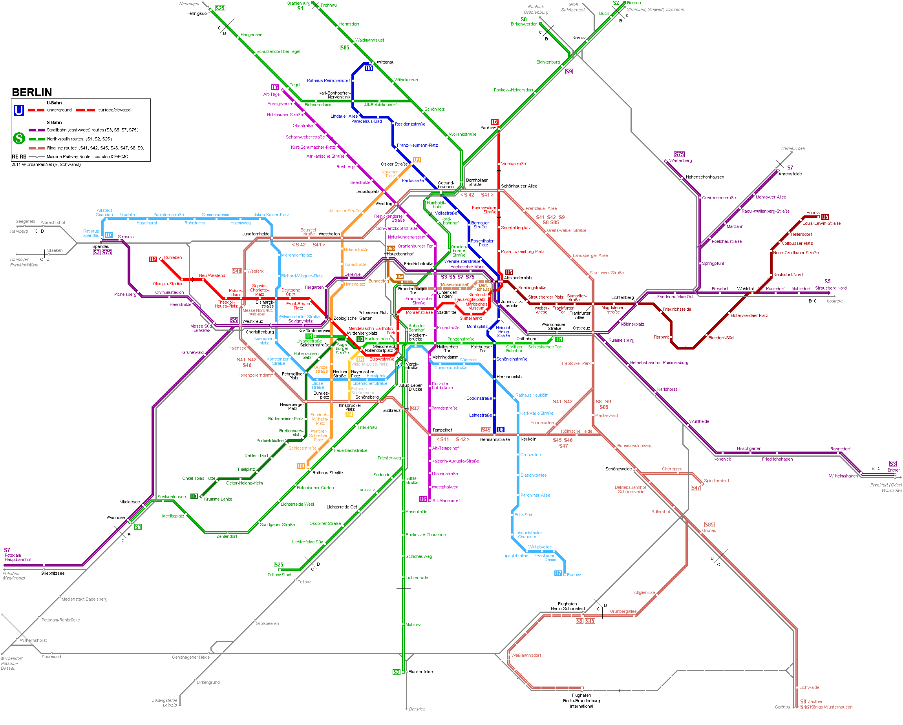

# Why V8 Fast?

  <small><a href="http://thlorenz.com">Thorsten Lorenz</a></small>

  <a href="https://nodesource.com/">
    <svg width="60px" viewBox="0 0 97.34 97.34"><path d="M48.67,3.89A44.78,44.78,0,1,1,3.89,48.67,44.83,44.83,0,0,1,48.67,3.89m0-3.89A48.67,48.67,0,1,0,97.34,48.67,48.73,48.73,0,0,0,48.67,0Z"></path><path d="M49.81,71a1.14,1.14,0,1,1-2.28,0V26.34a1.14,1.14,0,1,1,2.28,0Z"></path><path d="M33.61,60.93A2,2,0,0,1,32,60.15l-12.22-16V59a2,2,0,0,1-3.94,0V38.39a2,2,0,0,1,3.53-1.2l12.22,16V38.39a2,2,0,0,1,3.94,0V59a2,2,0,0,1-2,2Z"></path><path d="M77.6,41.8l-.52-.31a15,15,0,0,0-1.39-.69,11.2,11.2,0,0,0-2.24-.71,10.08,10.08,0,0,0-3-.12,6.05,6.05,0,0,0-3,1,2.66,2.66,0,0,0-.85,1,2.47,2.47,0,0,0-.18.63V43s0-.2,0-.09v0a5.48,5.48,0,0,0,0,.55A2,2,0,0,0,67,44.53a4.81,4.81,0,0,0,1.52,1,13.64,13.64,0,0,0,2.19.7c.39.1.8.18,1.2.26s.85.16,1.37.29a14.23,14.23,0,0,1,5.62,2.49A6.69,6.69,0,0,1,81,52.19a6,6,0,0,1,.33,1.87v.66l0,.15,0,.16a5.29,5.29,0,0,1-.15.76,7.12,7.12,0,0,1-4.41,4.67,13.34,13.34,0,0,1-5,.91,11,11,0,0,1-1.14-.07c-.43,0-.78-.11-1.14-.17a14.27,14.27,0,0,1-1.92-.54,16.35,16.35,0,0,1-2.84-1.37,14.56,14.56,0,0,1-2.22-1.63l-.08-.08a1.77,1.77,0,0,1,2.34-2.65A12,12,0,0,0,66.58,56a13.43,13.43,0,0,0,2.25,1,10.4,10.4,0,0,0,1.4.36c.24,0,.51.08.71.09s.65,0,.81,0a9.48,9.48,0,0,0,3.46-.61,3.34,3.34,0,0,0,2.08-1.93,2.21,2.21,0,0,0-.91-2.57,10.59,10.59,0,0,0-4-1.71c-.34-.09-.88-.19-1.23-.26s-.93-.18-1.4-.3a17.46,17.46,0,0,1-2.83-.92,8.63,8.63,0,0,1-2.79-1.86,5.89,5.89,0,0,1-1.62-3.43c0-.34,0-.45-.05-.69V42.6c0-.15,0-.29,0-.44a6.41,6.41,0,0,1,.47-1.7A6.6,6.6,0,0,1,65,37.88,9.87,9.87,0,0,1,70,36a12.79,12.79,0,0,1,7.25,1.36A13.58,13.58,0,0,1,79,38.47l.54.4a1.77,1.77,0,0,1-2,3Z"></path><path d="M90.29,0a7.06,7.06,0,1,0,7.06,7.06A7.06,7.06,0,0,0,90.29,0Zm0,12.87A5.81,5.81,0,1,1,96.1,7.06,5.82,5.82,0,0,1,90.29,12.87Z"></path><path d="M88.58,10.24A.61.61,0,0,1,88,9.63V4.48a.61.61,0,0,1,.61-.61H91a1.89,1.89,0,1,1,0,3.78H89.19v2A.61.61,0,0,1,88.58,10.24Zm.61-3.81H91c.49,0,.81-.26.81-.67s-.32-.67-.81-.67H89.19Z"></path><path d="M92.41,10.24a.61.61,0,0,1-.5-.26L90.1,7.41a.61.61,0,0,1,1-.7l1.82,2.57a.61.61,0,0,1-.5,1Z"></path></svg>
  </a>

  <small>twitter <a href="http://twitter.com/thlorenz">@thlorenz</a>  |  github  <a href="http://github/thlorenz">@thlorenz</a>

# Sea of Nodes

<video
  type="video/mp4"
  muted
  width="100%"
  loop
  autoplay
  src="img/sea-of-nodes.m4v">
</video>

# Sea of Nodes

# Sea of Nodes

- _control dependencies_ between operations instead of program order
- expresses many legal orderings

# Sea of Nodes

# Sea of Nodes

### Enables Many Optimizations 

- better redundant code elimination due to more code motion
- loop peeling
- control flow elimination
- many more ...

<!-- 
- control flow elimination turns branch chains into switches
-->

# Sea of Nodes

- CFG (control flow graph) is built after applying optimizations

### 

# CodeStub Assembler
