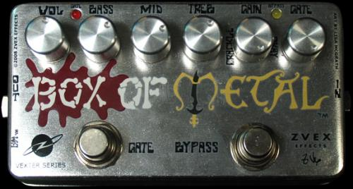
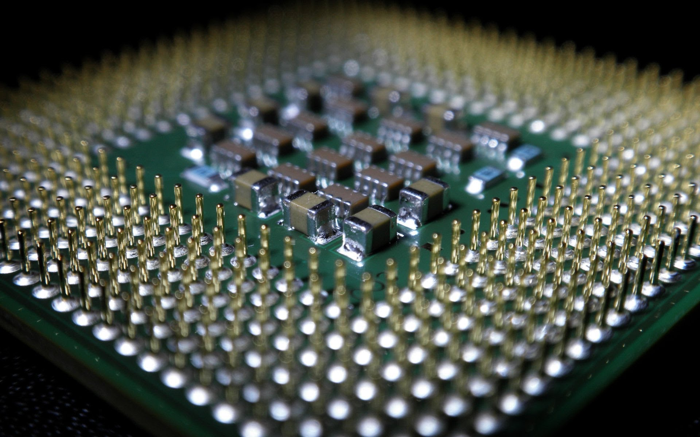
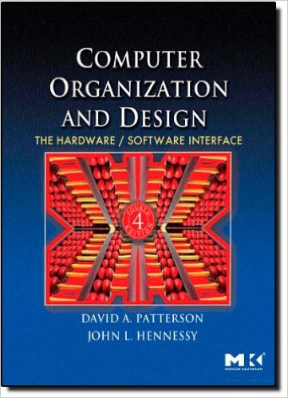
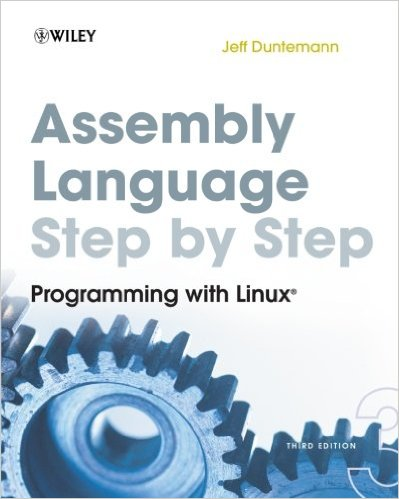
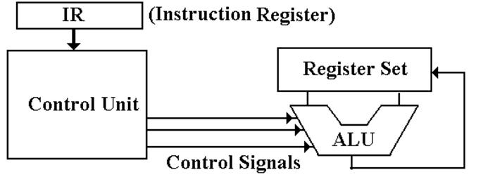

# visulator

*Learn about CPUs and Assembly on an interactive Playground*

<p style="text-align: center;">
  
</p>
<p style="text-align: center;">
  <small><a href="http://thlorenz.com">Thorsten Lorenz</a></small>
</p>
<p style="text-align: center;">
  <small>twitter <a href="http://twitter.com/thlorenz">@thlorenz</a>  |  github  <a href="http://github/thlorenz">@thlorenz</a>  |  irc  thlorenz</small>
</p>

# why should anyone learn assembly


# why should anyone learn assembly

- it gets you as close to the metal as you can without writing `0`s and `1`s



# why should anyone learn assembly

- but it won't kill ya


# why should anyone learn assembly

- it teaches you how the CPU works



<!-- notes
- that is good to know no matter which language you use or how high in the stack you're working
- it's also the only language in which you can control specific things like what gets stored in registers vs. memory and
  more
-->

# why should anyone learn assembly

- it is super important if you write highly performant code like the guts of node

```c
// deps/uv/src/unix/atomic-ops.h
#if defined(__i386__) || defined(__x86_64__)
  int out;
  __asm__ __volatile__ ("lock; cmpxchg %2, %1;"
                        : "=a" (out), "+m" (*(volatile int*) ptr)
                        : "r" (newval), "0" (oldval)
                        : "memory");
  return out;
#else
[...]
```

# why should anyone learn assembly

- assemble assembly code to CPU opcodes and back to assembly with a disassembler

```asm
'b8 ff ff ff 7f'  mov   eax, 0x7fffffff
'83 c0 01'        add   eax, 1
```

<!-- notes
- no other language can do that without debugging symbols or other help like source maps
-->

# but it's too hard


# but it's too hard


# my story


# my story



# my story


# my story


# my story


# my story


# my story


# my story



# my story


# demo


# CPU crash course



<!-- notes
- memory not shown
- input signals result in output signal stored in a register
- flags set according to outcome
- flags influence outcome of instructions that follow
-->

# CPU crash course


```
add ecx, 0x1
or  ebx, ecx
```

<!-- notes
- point out Intel Syntax
-->


# demo for real now


<!-- notes
- explain ZF, SF, CF
- eax, ax, ah, al
- opcode input
- ZF with dec bl, dec bl
-->

# resources

- [_Computer Organization and Design_
  book](http://www.amazon.com/Computer-Organization-Design-Fourth-Edition/dp/0123744938)
- [GDB debugger](http://www.gnu.org/software/gdb/)
- [peda GDB plugin](https://github.com/longld/peda)
- [**G**db **A**ssembly **I**nformant](https://github.com/thlorenz/gai)
- [capstone disassembly framework](http://www.capstone-engine.org/)
- [capstone.js](https://github.com/AlexAltea/capstone.js) ported via [emscripten](https://github.com/kripken/emscripten)
- [lib.asm](https://github.com/thlorenz/lib.asm) collection of utilities in x86 assembly
- [visulator]( https://thlorenz.github.io/visulator)
- [visulator documentation](https://github.com/thlorenz/visulator/blob/master/README.md)
- [@thlorenz](http://twitter.com/thlorenz) on twitter
